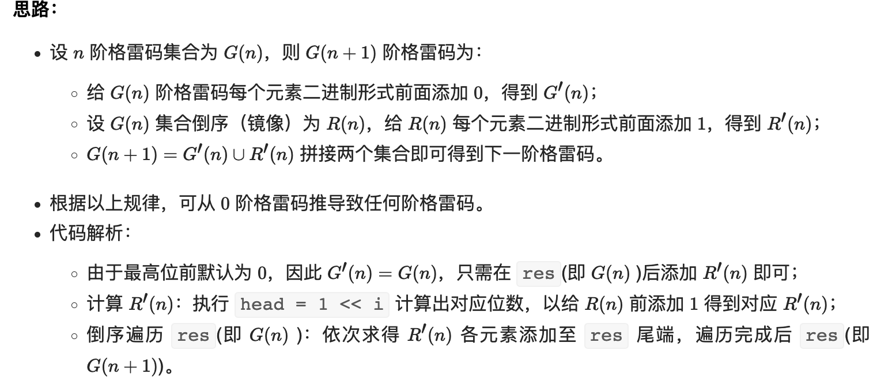
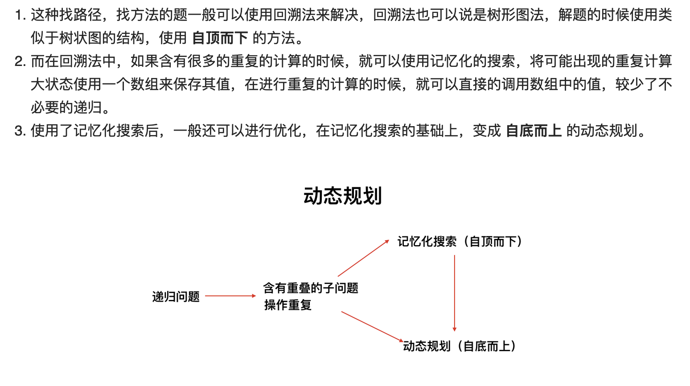
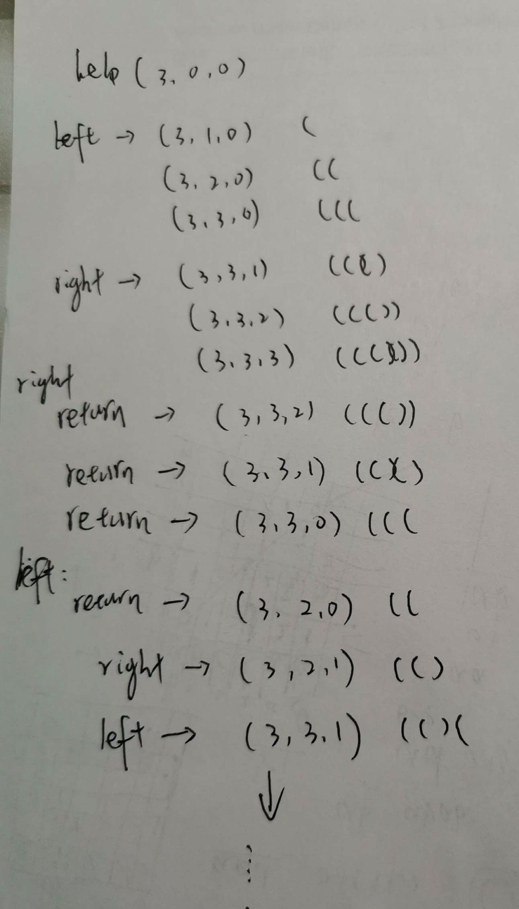
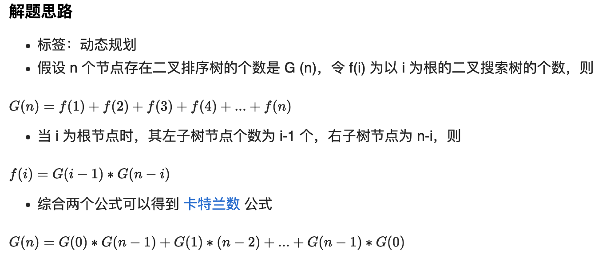
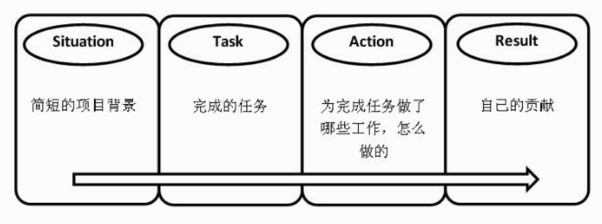
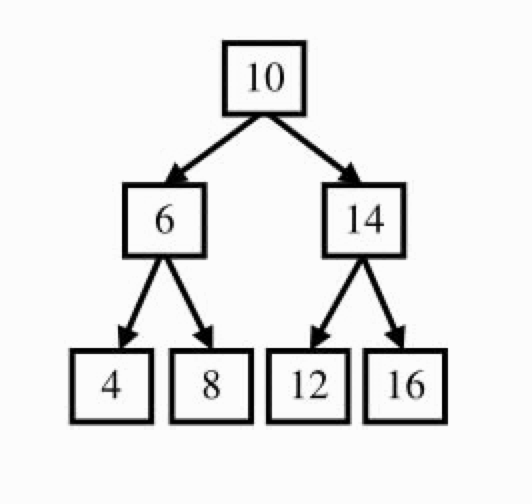
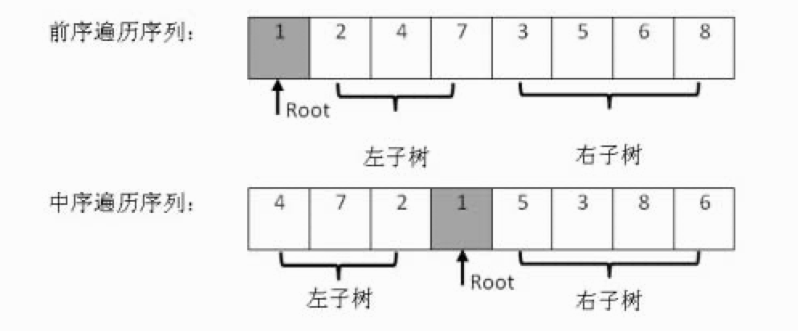
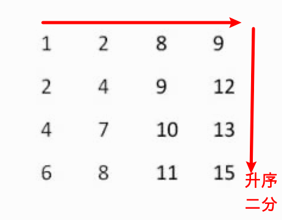

# algorithm

[toc]


牛客IOC

https://ac.nowcoder.com/acm/contest/5652#question


牛客题霸-求职必刷题

https://www.nowcoder.com/ta/job-code


按公司刷题

https://codetop.cc


# 小笔记

## 二维数组

### 与一维转换

```java
grid[3][4]
int r = grid.length;
int c = grid[0].length;

// 在列上做变换
[i][j] -->[t]
int code = i*c+j;

[t] --> [i][j]
int i = code/c;
int j = code%c;
```

### 排序

```java
// intervals = [][] 根据第一个升序
Arrays.sort(intervals, Comparator.comparingInt(a -> a[0]));
```


### List2二维数组

```java
List<int[]> list = new ArrayList<>();
list.toArray(new int[list.size()][]);
res.toArray(new int[0][]);
```


## JavaIO

```java
import java.util.*;
import java.io.*;

public class Main{
    public static void main(String[] args) throws Exception{
        Scanner sc = new Scanner(System.in);
        while(sc.hasNextLine()) {
            String[] s = sc.nextLine().split(" ");
            System.out.println(Integer.parseInt(s[0]) + Integer.parseInt(s[1]));
        }
        
        BufferedReader br = new BufferedReader(new InputStreamReader(System.in));
        String line;
        while((line = br.readLine()) != null) {
            String[] s = line.split(" ");
            System.out.println(Integer.parseInt(s[0]) + Integer.parseInt(s[1]));
        }
    }
}
```


## 回文

中心扩展法

#### [647. 回文子串](https://leetcode-cn.com/problems/palindromic-substrings/)

- 个数

#### [5. 最长回文子串](https://leetcode-cn.com/problems/longest-palindromic-substring/)

```java
class Solution {
    /*
        中心扩展法
    */
    int ans = 0;
    public int countSubstrings(String s) {
        if (s == null || s.equals(""))
            return 0;
        int res = s.length();
        for (int i = 0; i < s.length(); i++) {
            // 单数时
            help(s, i, i);
            // 双数时
            help(s, i, i+1);
        }
        return ans;
    }

    public void help(String s, int start, int end) {
        while (start >= 0 && end < s.length() && s.charAt(start) == s.charAt(end)) {
            ans++;
            start--;
            end++;
        }
    }
}
```


# leetcode

## easy

#### 1. 两数之和

**加法变减法**

```
* 1. 使用hashmap:查找元素为O(1)
* 2. b = tar-a is in nums
```

#### 7. int数反转

```java
* 1. 数字反转，123-->321：*升位 /降位 %取个位
* 2. 防止溢出：ans溢出/10一定不等于temp=ans*10 

/*
	第8题
*/
class Solution {
    public int strToInt(String str) {
        str = str.trim();
        if (str.length() == 0)  return 0;
        int res = 0, temp = 0, i = 0;
        if (str.charAt(0) == '-' || str.charAt(0) == '+') {
            i = 1;
        } 

        while (i < str.length() && (str.charAt(i)-'0' < 10 && str.charAt(i)-'0' >= 0)) {
            // 防止溢出
            temp = res;
            res = 10 * res + str.charAt(i)-'0';
            // 溢出一定不相等
            if(res/10 != temp) {
                return str.charAt(0) == '-' ? Integer.MIN_VALUE : Integer.MAX_VALUE;
            }
            i++;
        }
        return str.charAt(0) == '-' ? -res : res;
    }
}
```

#### 13. 罗马数字

用**字典保存**每种情况，依次遍历；

#### 14. 最长公共前缀  

两两词比较得公共串，公共串在与后面词继续比较

#### 20. 有效的括号

左括号入栈，遇右括号出栈；HashMap作匹配

```java
public static void main(String[] args) {
  // 双端队列--栈
  Deque<Object> stack = new LinkedList<>();
  // 入栈
  stack.push(1);
  // 获取栈顶元素
  System.out.println(stack.peek());
  // 出栈
  stack.pop();
  System.out.println(stack.peek());

  // 队列
  Queue<Object> queue = new LinkedList<>();
}
```


#### 26. 删除排序数组中的重复项 : 

- **排序数组**

#### 27. 移除元素  ；返回新长度

1. 原地操作：
   1. 重复：两个指针监听：一个指向唯一，另一个找唯一；
   2. 当不相等时，将新唯一赋予当前下一个元素，新唯一变唯一

2. 移除val：
   1. 重点：元素的顺序可以改变
   2. 思路：两个指针i、j，i 找val, 另一个j从后面找不是val填充 i 的val
   3. 处理边界值

#### 28. 匹配字串：KMP

1. 适用于重复字符串

2. https://www.zhihu.com/question/21923021

3. 简言之，以图中的例子来说，在 i 处失配，那么主字符串和模式字符串的前边6位就是相同的。又因为模式字符串的前6位，它的前4位前缀和后4位后缀是相同的，所以我们推知主字符串i之前的4位和模式字符串开头的4位是相同的。就是图中的灰色部分。那这部分就不用再比较了。

4. 

5. 在把PMT【部分匹配表(Partial Match Table)】进行向右偏移时，第0位的值，我们将其设成了-1，这只是为了编程的方便，并没有其他的意义。在本节的例子中，next数组如下表所示。

   

#### 35. 搜索插入位置

给定一个**排序数组**和一个**目标值**，在数组中***找到*目标值，并返回其索引**。如果目标值不存在于数组中，返回它将会被按顺序插入的位置。

-----

> # **查找题**

1. 二分法

   ```java
   while (l <= r) {
     // int mid = (l+r)/2;		// 拒绝使用，l+r可能超出整型溢出
     int mid = l + (r - l) / 2;		// (l+r)/2 = l + (r - l) / 2；不会溢出
     if (nums[mid] >= target) {
       r = mid-1;
     } else {
       l = mid+1;
     }
   }
   return l;
   ```

   - mid = (l + r) / 2的劣势:
     - 溢出
     - 求上下界会不统一
   - mid = l + (r - l) / 2
     - 减法替代了加法
     - 除法代替乘法

#### 38. 外观数列

1. 递归

2. - String 是final对象，不会被修改，每次使用 + 进行拼接都会创建新的对象，而不是改变原来的对象；`速度最慢`

   * 2.StringBuffer 可变字符串，主要用于字符串的拼接，`属于线程安全的`；
     * 因为方法加入了`synchronized`关键字，是一种同步锁
   * 3.StringBuilder 可变字符串，主要用于字符串的拼接，属于线程不安全的；`速度最快`

#### 53. 最大子序和

1.     * 只考虑当前 nums[i], 上一个值的最大值+当前值是否大于当前值，
       * 是，则加入到子数组； 否，则当前值更大
       * 比较大小用Math.max();

#### 67. 二进制求和

1. ```java
   // 2进制转10进制
   System.out.println(Integer.parseInt("11", 2));
   // 10进制转2进制
   System.out.println(Integer.toBinaryString(10));
   ```

2. 加一个carry获取进位， carry % 2当前答案，carry/2当前答案； 遍历完carry!=0在加1

#### 69. x的平方根

1. 二分法

   ```java
   public int mySqrt(int x) {
     int l = 0, r = x, ans = 0;
     while(l <= r) {
       /*
        * 拒绝使用，l+r可能超出整型溢出
        * */
       // int mid = (l+r)/2;
   
       /*
        * 加法变减法的思想
        * (l+r)/2 = l + (r - l) / 2；不会溢出
        * */
       int mid = l + (r - l) / 2;
       /*
        * if (mid <= x * 1.0 / mid)  乘法变除法思想
        * 错误(long)(mid * mid)  已经溢出
        * */
       if ((long)mid * mid <= x) {
         ans = mid;
         l = mid + 1;
       } else {
         r = mid - 1;
       }
     }
     return ans;
   }
   ```


#### 70. 爬楼梯

​	假设你正在爬楼梯。需要 n 阶你才能到达楼顶。 每次你可以爬 1 或 2 个台阶。你有多少种不同的方法可以爬到楼顶呢？

```java
    /*
    * 1. 递归--dfs
    * 超时
    * */

    public int climbStairs(int n) {
        if (n == 0) return 1;       // 1，1，1
        if (n < 0) return 0;
        int ans = 0;
        // 1 or 2 steps
        for (int i = 1; i <=2; i++) {
            ans += climbStairs(n-i);
        }
        return ans;
    }


    /*
    * 动态规划
    * f(x) = f(x-1) + f(x-2)
    * 理解为：一共n阶台阶，到最后一个选择时，有两种选择：【无视前面走法， 例如4】
    *       ​ 1.走一步【1,1,1; 1,2; 2,1] -> 1
    *       ​ 2.走两步【1,1; 2】-> 2
    * */

    public int climbStairsD(int n) {
        int[] dp = new int[n+1];
        dp[0] = 1;
        dp[1] = 1;

        for (int i = 2; i <= n; i++)
            dp[i] = dp[i-1] + dp[i-2];
        return dp[n];
    }

```

2. 斐波那契数列:

   

#### 100. 相同的树

1. 二叉树的遍历

   - dfs：
     - 递归：trav(root.left), trav(root.right);
     - 栈：push(root), pop(top); push(top.right), push(top.left), pop(top); push....

   ```java
   /**
    * Definition for a binary tree node.
    * public class TreeNode {
    *     int val;
    *     TreeNode left;
    *     TreeNode right;
    *     TreeNode() {}
    *     TreeNode(int val) { this.val = val; }
    *     TreeNode(int val, TreeNode left, TreeNode right) {
    *         this.val = val;
    *         this.left = left;
    *         this.right = right;
    *     }
    * }
    */
   class Solution {
       public boolean isSameTree(TreeNode p, TreeNode q) {
           /*
            * 包含：两者均为空 ； 或者其中一个为空
           */
           if (p == null || q == null)
               return p == q;
           // dfs[深度搜索]--递归
           return p.val == q.val &&
                   isSameTree(p.left, q.left) &&
                   isSameTree(p.right, q.right);
       }
   }
   ```

#### 101. 对称二叉树

1. **引入一个队列，这是把递归程序改写成迭代程序的常用方法**

2. 队列

   ```java
   Queue<TreeNode> queue = new LinkedList<>();
   
   add  增加一个元索   如果队列已满，则抛出一个IIIegaISlabEepeplian异常
   offer  添加一个元素并返回true  如果队列已满，则返回false
   put  添加一个元素 如果队列满，则阻塞
   
   remove   移除并返回队列头部的元素     如果队列为空，则抛出一个NoSuchElementException异常
   poll  移除并返问队列头部的元素 如果队列为空，则返回null
   take 移除并返回队列头部的元素
   
   element  返回队列头部的元素   如果队列为空，则抛出一个NoSuchElementException异常
   peek       返回队列头部的元素   如果队列为空，则返回null
   ```


#### 104. 二叉树的最大深度

1. 递归遍历，DFS深度优先搜索

   - 左子树和右子树的最大深度 L 和 R，那么该二叉树的最大深度即为

   - max(l,r)+1

     ```java
     public int maxDepth(TreeNode root) {
     	return root == null ? 0 : Math.max(maxDepth(root.left), maxDepth(root.right)) + 1;
     }
     ```

2. 广度优先搜索

   - 队列里存放的是当前层的所有节点，即我们是一层一层地进行拓展

     ```java
     public int maxDepth(TreeNode root) {
       if (root == null)
         return 0;
       Queue<TreeNode> queue = new LinkedList<>();
       int ans = 0;
       // 加入第一层根节点
       queue.offer(root);
       // 判断队列是否为空，即遍历完所有节点
       while(!queue.isEmpty()) {
         // 获得该层节点的数目
         int size = queue.size();
         // 遍历该层节点，添加下层节点，删除本层节点
         while(size > 0) {
           // 头节点出对
           TreeNode t = queue.poll();
           // 本层节点减1
           size--;
           // 加入左右不为null节点
           if (t.left != null)
             queue.offer(t.left);
           if (t.right != null)
             queue.offer(t.right);
         }
         // 层数+1
         ans += 1;
       }
       return ans;
     }
     ```

#### 107. 二叉树的层次遍历 II

1. ```java
   class Solution {
       public List<List<Integer>> levelOrderBottom(TreeNode root) {
           /*层次遍历， 往结果集头部插*/ 
         	// List无addFirst方法
           LinkedList<List<Integer>> result = new LinkedList<List<Integer>>();
           if (root == null)
               return result;
           Queue<TreeNode> queue = new LinkedList<>();
           queue.offer(root);
   
           while (!queue.isEmpty()) {
               int size = queue.size();
               List<Integer> temp = new ArrayList<>();
               while (size > 0) {
                   TreeNode curr = queue.poll();
                   temp.add(curr.val);
                   TreeNode l = curr.left, r = curr.right;
                   if (l != null)
                       queue.offer(l);
                   if (r != null)
                       queue.offer(r);
                       size--;
               }
               result.addFirst(temp);
               // result.add(0, temp);
           }
           return result;
       }
   }
   ```


#### 108. 将有序数组转换为二叉搜索树

1. ```java
   public class E_108_sortedArrayToBST {
       /*
       * 思路：递归，总选数组的中间点作为根节点，即中序遍历
       * 排序数组
       * */
       public TreeNode sortedArrayToBST(int[] nums) {
           if (nums.length == 0)
               return null;
           if (nums.length == 1)
               return new TreeNode(nums[0]);
   
           // 选择数组中间节点
           int mid = nums.length / 2;
           // 为根节点
           TreeNode tree = new TreeNode(nums[mid]);
           // 左半数组[0, mid]为左节点
           tree.left = sortedArrayToBST(Arrays.copyOf(nums, mid));
           // 右办数组[mid, length]为右节点
           tree.right = sortedArrayToBST(Arrays.copyOfRange(nums, mid+1, nums.length));
           return tree;
       }
   }
   ```

#### 110. 平衡二叉树

1. ```java
   public boolean isBalanced(TreeNode root) {
           return test(root) != -1; 
       }
   
       // -1代表不是平衡二叉树
       public int test(TreeNode root) {
           if (root == null)
               return 0;
           int l = test(root.left);
           if (l == -1)
               return -1;
           int r = test(root.right);
           if(r == -1)
               return -1;
           // 判断当前是否为平衡二叉树，如是，高度+1
           return Math.abs(l-r) <= 1 ? Math.max(l, r)+1 : -1;
       }
   ```


## mid

### 6. Z 字形变换

```java
/*
* 思路，用数组装
* 在第 0 行或 numR-1 行时换方向【想到首尾】
* 向下加 换方向 向上加
*/
class Solution {
    public String convert(String s, int numRows) {
        if (s.length() <= numRows || numRows < 2)
            return s;
        // 装每一行
        List<StringBuilder> rows = new ArrayList<>();
        for (int i = 0; i < numRows; i++)
            // 留意该种初始化 rows.get(i) = new StringBuilder();【final,错误】
            rows.add(new StringBuilder());
        
        /*
        * mark代表行标-上下来回，
        * flag换方向【1为向下,-1为向上；0行刚好变号，所以初始为-1】
        */ 
        int mark = 0, flag = -1;
        // 遍历
        for (int i = 0; i < s.length(); i++) {
            // 换方向
            if(mark == 0 || mark == numRows-1) {
                flag = -flag;
            }
            // 每行加对应字符
            rows.get(mark).append(s.charAt(i));
            // 很巧妙【来回传递】
            mark += flag;
        }
        StringBuilder res = new StringBuilder();
        for(StringBuilder sb : rows)
            res.append(sb);
        return res.toString();
    }
}
```


### 31. 下一个排列

```java
class Solution {
    /*
    * 思路：
    * 1. 从后找倒叙【不是倒叙的标志位】
    * 2. 在倒叙中找刚好大于nums[mark]的数进行交换
    * 3. 交换之后在将倒叙数变正序变最小
    */
    public void nextPermutation(int[] nums) {
        // 指向当前非倒叙数
        int mark = nums.length-2;
        // 从后找倒序mark
        for (; mark >=0; mark--) {
            // 找到非倒叙位
            if (nums[mark] < nums[mark+1]) {
                break;
            }
        }
        if (mark >= 0) {
            // 找倒叙中找刚好大于nums[mark]的
            for (int i = nums.length-1; i > mark; i--) {
                if (nums[i] > nums[mark]) {
                    swap(nums, i, mark);
                    break;
                }
            }
            
        }
        // 将倒叙变正序变为最小
        int i = nums.length-1;
        int j = mark+1;
        while (j < i) {
            swap(nums, i, j);
            i--;
            j++;
        }
    }

    public void swap(int[] nums, int i, int j) {
        int t = nums[i];
        nums[i] = nums[j];
        nums[j] = t;
    }
}
```

### 43. 字符串相乘

- 大数相乘-字符串模拟


```java
class Solution {
    // 字符串表达的数字上模拟乘法
    public String multiply(String num1, String num2) {
        if (num1.equals("0") || num2.equals("0"))
            return "0";
        int lena = num1.length();
        int lenb = num2.length();
        // 相乘最大位数【i保存进位，i+1为相乘位】,初始为0
        int ans[] = new int[lena+lenb];
        /*
            123
           * 45
        ---------
        */
        // 从后向前提取字符乘
        for (int i = lena-1; i >= 0; i--) {
            int a = num1.charAt(i)-'0';
            for (int j = lenb-1; j >= 0; j--) {
                int b = num2.charAt(j)-'0';
                // 进位 + 相乘值
                int res = ans[i+j+1] + a*b;
                ans[i+j+1] = res%10;     // 相乘值个位
                ans[i+j] += res/10;       // 相乘值进位 + 之前进位
            }
        }
        StringBuilder sb = new StringBuilder();
        // 从前往后不用乘
        for (int i = 0; i < ans.length; i++) {
            // 123*100 首位可能不为0
            if (i == 0 && ans[i] == 0)
                continue;
            sb.append(ans[i]);
        }
        return sb.toString();
    }
}
```


### 48. 旋转图像

- 二维矩阵技巧
  - 水平、对角翻折

```java
class Solution {
    /*
       1. 先水平翻折
       2. 在沿对角线翻折
    */ 
    public void rotate(int[][] matrix) {
        int m = matrix.length;
        int temp = 0;
        // 必须只翻折一半，否则又翻折回原来了
        for(int i = 0; i < m / 2; i++) {
            for (int j = 0; j < m; j++) {
                // 水平翻折
                temp = matrix[i][j];
                matrix[i][j] = matrix[m-i-1][j];
                matrix[m-i-1][j] = temp;
            }
        }

        for(int i = 0; i < m; i++) {
            // 只遍历下三角
            for (int j = 0; j < i; j++) {
                // 主对角线翻转
                temp = matrix[i][j];
                matrix[i][j] = matrix[j][i];
                matrix[j][i] = temp;
            }
        }
    }
}
```


### 114. 二叉树展开为链表

- 给定一个二叉树，[原地](https://baike.baidu.com/item/原地算法/8010757)将它展开为一个单链表。
- 思想很重要

```java
class Solution {
    public void flatten(TreeNode root) {
        if (root == null)
            return;
        flatten(root.left);
        TreeNode right = root.right;
        root.right = root.left;
        root.left = null;
      	// 很重要 
        while (root.right != null) {
            root = root.right;
        }
        flatten(right);
        root.right = right;
    }
}
```


### 50. Pow(x, n)

- 快速幂
- 位运算技巧
  - n % 2==1 等价于 奇数==判断二进制最右位 n&1 是否为1
  - n = n/2 : 等价于 右移一位 n>>1 ；
- 二进制

```java
class Solution {
    /*
        1. 快速幂
        2. x→x^2→x^4→x^9→x^19→x^38→x^77【右到左看】
        3. 递归只考虑正数：负--> 1.0/-n
    */ 
    public double myPow(double x, int n) {
        // -2^31 转正
        long N = n;
        return N > 0 ? iter(x, N) : 1.0/iter(x, -N);
    }
    /*
        迭代，位运算技巧[二进制]
        x^n = x*(n的二进制迭代次)
        5^3 = 5^(11)
    */ 
    public double iter(double x, long N) {
        double ans = 1.0;
        // 贡献的初始值为 x
        double x_contribute = x;
        // 在对 N 进行二进制拆分的同时计算答案
        while (N > 0) {
            // 奇数==判断二进制最右位 n&1 是否为1
            if (N % 2 == 1) {
                // 如果 N 二进制表示的最低位为 1，那么需要计入贡献
                ans *= x_contribute;
            }
            // 将贡献不断地平方
            x_contribute *= x_contribute;
            // 舍弃 N 二进制表示的最低位，这样我们每次只要判断最低位即可
            // 等价于 右移一位 n>>1 ；
            N /= 2;
        }
        return ans;
    }

    /*
        根据递归计算的结果，如果 n为偶数，那么 x^n=y^2；如果 n为奇数，那么 x^n=y^2∗x；    
    */ 
    public double help(double x, long n) {
        if (n == 0)
            return 1.0;
        double y = help(x, n/2);
        return n % 2 == 0 ? y*y : y*y*x;
    }
}
```


### 89. 格雷编码

- 数字电路
- https://leetcode-cn.com/problems/gray-code/solution/gray-code-jing-xiang-fan-she-fa-by-jyd/



- 如果再增加一位，无非是在最高位增加 0 或者 1，考虑先增加 0。由于加的是 0，其实数值并没有变化。https://leetcode-cn.com/problems/gray-code/solution/xiang-xi-tong-su-de-si-lu-fen-xi-duo-jie-fa-by--12/

```java
public List<Integer> grayCode(int n) {
    List<Integer> gray = new ArrayList<Integer>();
    gray.add(0); //初始化 n = 0 的解
    for (int i = 0; i < n; i++) {
        int add = 1 << i; //要加的数
        //倒序遍历，并且加上一个值添加到结果中
        for (int j = gray.size() - 1; j >= 0; j--) {
            gray.add(gray.get(j) + add);
        }
    }
    return gray;
}
```


### 116. 填充每个节点的下一个右侧节点指针


```java
class Solution {

    /*
        2. 借助next指针, 链表思想
            1）head.left.next = head.right          // 同根
            2）head.right.next = head.next.left     // 异根
    */
    public Node connect(Node root) {
        if (root == null)
            return null;
        // 当前层最左
        Node most_left = root;
        while (most_left.left != null) {
            Node head = most_left;
            while (head != null) {
                // 构建同根
                head.left.next = head.right;
                // 构建异根
                if (head.next != null)
                    head.right.next = head.next.left;
                // 同层下一个节点
                head = head.next;
            }
            // 下一层
            most_left = most_left.left;
        }
        return root;
    }
}


		/*
        3. 递归，拉拉链解法
        根节点的左节点的右节点 .next = 根节点的右节点的左节点
          
    */
    public Node connect(Node root) {
        dfs(root);
        return root;
    }
    public void dfs(Node root) {
        if (root == null) 
            return;
        Node left = root.left;
        Node right = root.right;
        // 精辟之处
        while (left != null) {
            left.next = right;
            left = left.right;
            right = right.left;
        }
        // left, right已经更改，莫直接
        dfs(root.left);
        dfs(root.right);
    }

		// 使用next连
    public Node connect(Node root) {
        if (root == null || root.left == null)
            return root;
        root.left.next = root.right;
        // 关键之处
        root.right.next = (root.next != null ? root.next.left : null);
        connect(root.left);
        connect(root.right);
        return root;
    }
```


### [146. LRU 缓存机制](https://leetcode-cn.com/problems/lru-cache/)

[LRU (最近最少使用) 缓存机制](https://baike.baidu.com/item/LRU) 。

```java
class LRUCache {
    /*
        LinkedHashMap的实现
        哈希表+双向链表
    */
    class DNode {
        int key, value;
        DNode pre, next;
        DNode() {}
        DNode(int key, int value) {
            this.key = key;
            this.value = value;
        }
    }

    Map<Integer, DNode> cache = new HashMap<>();
    int size, capacity;
    // 伪节点
    DNode head, tail;
    public LRUCache(int capacity) {
        this.size = 0; 
        this.capacity = capacity;
        this.head = new DNode();
        this.tail = new DNode();
        this.head.next = this.tail;
        this.tail.pre = this.head;
    }
    
    public int get(int key) {
        DNode node = cache.get(key);
        if (node == null)
            return -1;
        moveToHead(node);
        return node.value;
    }
    
    public void put(int key, int value) {
        DNode node = cache.get(key);
        if (node == null) {
            DNode new_node = new DNode(key, value);
            cache.put(key, new_node);
            addToHead(new_node);
            ++size;
            if (size > capacity) {
                DNode tail = removeTail();
                cache.remove(tail.key);
                size--;
            }
        } else {
            node.value = value;
            moveToHead(node);
        }
    }

    private void addToHead(DNode node) {
        head.next.pre = node;
        node.next = head.next;
        head.next = node;
        node.pre = head;
    }

    private void moveToHead(DNode node) {
        removeNode(node);
        addToHead(node);
    }

    private void removeNode(DNode node) {
        node.pre.next = node.next;
        node.next.pre = node.pre;
    }

    // 超出容量时移除
    private DNode removeTail() {
        DNode tail_node = tail.pre;
        removeNode(tail_node);
        return tail_node;
    }
}

```


## 递归

#### [437. 路径总和 III](https://leetcode-cn.com/problems/path-sum-iii/)

- 找出路径和等于给定数值的路径总数。

- 路径不需要从根节点开始，也不需要在叶子节点结束，但是路径方向必须是向下的（只能从父节点到子节点）
- 存在正负数

#### 优秀递归

```java
class Solution {
    int ans = 0;
    /*
        等于 == 以root为路径 + 以左为路径 + 以右为路径
        对每个节点，有两种情况：
            1. 在这个节点为根节点的树中找路径，同时以该节点为起始节点 
            2. 在这个节点的子树中找。
        
        // *****相当于每次都从根到子节点的路径******** //
    */
    public int pathSum(TreeNode root, int sum) {
        if (root == null)
            return 0;
        // 关键之处，以左右又作为新节点
        return help(root, sum) + pathSum(root.left, sum) + pathSum(root.right, sum);
    }

    public int help(TreeNode root, int target) {
        // 找不到满足
        if (root == null)
            return 0;
        int count = 0;
        if (target == root.val) {
            // 满足一条
            count = 1;
        }
        /*
            因为存在正负数，存在这种案例
            [1,-2,-3,1,3,-2,null,-1] -1

            [1,-2],[1,-2,1,-1]：以根节点为路径的可能不止一条
        */ 
        count += help(root.left, target-root.val);
        count += help(root.right, target-root.val);
        return count;        
    }
}
```


## 双指针

- 排序
- 左右指针【L++,R--】
- 


### 11. 盛最多水的容器

```java
class Solution {
    /*
    * S = min(H_i,H_j) * index
    * 思路：双指针法
    * 1. 移动板，index = index-1一定减少，所以看移动长板还是短版
    *   假如移动长板，短板只会不变或更小，所以 S 一定不会增大
    *   在看移动短板，短板可能增大、不变、减少，所以S可能增大
    */
    public int maxArea(int[] height) {
        int l = 0, r = height.length-1, max = 0;
        while(l < r) {
            int s = Math.min(height[l], height[r]) * (r-l);
            max = Math.max(max, s);
            
            if (height[l] > height[r])
                r--;
            else
                l++;
        } 
        return max;
    }
}
```

### 15. 三数之和

```java
class Solution {

    /*
    * 排序 + 双指针i, l=i+1, r;
    * 当当前index与上一个index相同时，说明已经用过该方式，重复，跳下一个【-1，-1，0，1，2】
    */
    public List<List<Integer>> threeSum(int[] nums) {
        List<List<Integer>> list = new ArrayList<>();
        if (nums == null || nums.length < 3) return list;

        Arrays.sort(nums);
        if (nums[0] > 0) return list;

        for (int i = 0; i < nums.length-1; i++) {
          	// 此步预判快很多，提前结束
            if (nums[i] > 0)
            // 当前index与上一个index相同时，说明已经用过该方式，重复【-1，-1，0，1，2】
            if (i > 0 && nums[i] == nums[i-1])
                continue;
            int l = i+1, r = nums.length-1;
            while (l < r) {
                int sum = nums[i]+nums[l]+nums[r];
                if (sum == 0) {
                    list.add(Arrays.asList(nums[i], nums[l], nums[r]));
                    while(l < r && nums[l] == nums[l+1]) l++;
                    while(l < r && nums[r] == nums[r-1]) r--;
                    l++;
                    r--;
                } else if(sum < 0) {
                    l++;
                }else{
                    r--;
                }
            }
        }
        return list;
    }

}
```


### [16. 最接近的三数之和](https://leetcode-cn.com/problems/3sum-closest/)

```java
class Solution {
    public int threeSumClosest(int[] nums, int target) {
        Arrays.sort(nums);
        int min = Integer.MAX_VALUE, res = 0;
        for (int i = 0; i < nums.length; i++) {
            if (i > 0 && nums[i] == nums[i-1])
                continue;
            int left = i+1, right = nums.length-1;
            while (left < right) {
                int sum = nums[i]+nums[left]+nums[right];
                if (sum == target) {
                    return sum;
                }
                if (sum > target)
                    right--;
                else 
                    left++;
                if (Math.abs(sum - target) < min) {
                    res = sum;
                    min = Math.abs(sum - target);
                }
            }
        }
        return res;
    }
}
```


### 80. 删除排序数组中的重复项 II

```java
class Solution {
    /*
        双指针排序题-技巧题
        i指向当前遍历，j指向上一个待覆盖数，count为当前遍历的出现个数
        纸上走一遍流程
    */
    public int removeDuplicates(int[] nums) {
        // 第0个不可能被覆盖
        int j = 1, count = 1;
        for (int i = 1; i < nums.length; i++) {
            if (nums[i] == nums[i-1])
                count++;
            else
                count = 1;
            /*
                之前：自身交换
                当某个数 > 2，i-j发生错位，
                之后：将后面是数移上来覆盖该数
            */ 
            if (count <= 2) {
                nums[j++] = nums[i];
            }
        }
        // 返回是截止下一个索引 = 个数
        return j;
    }
}
```


### [142. 环形链表 II](https://leetcode-cn.com/problems/linked-list-cycle-ii/)

- 返回入环第一个节点


```java
public class Solution {

    /*
        数学推导+快慢指针
        总长为a+b+c, b+c为环，b为相遇点, 因为2*slow = fast
        则第一次相遇时fast走的距离：a + n(b+c) + b = 2*(a+b)
            => a = c+(n-1)(b+c)
        所以相遇点c+n-1圈环 = 头节点到入环节点
    */
    public ListNode detectCycle(ListNode head) {
        if (head == null || head.next == null)
            return null;
        ListNode slow = head, fast = head;
        while(fast != null) {
            if (fast.next != null)
                fast = fast.next.next;
            else
                return null;
            slow = slow.next;
            // 第一次相遇
            if (slow == fast) {
                ListNode p = head;
                while (p != slow) {
                    p = p.next;
                    slow = slow.next;
                }
                return p;
            }
        }
        return null;
    }


    /*
        哈希表
    */
    public ListNode detectCycle1(ListNode head) {
        ListNode pos = head;
        // [3,2,2,0,-4]，2与2虽然值一样，但是地址不一样，还是两个节点
        Set<ListNode> visited = new HashSet<ListNode>();
        while (pos != null) {
            if (visited.contains(pos)) {
                return pos;
            } else {
                visited.add(pos);
            }
            pos = pos.next;
        }
        return null;
    }
}
```


### [209. 长度最小的子数组](https://leetcode-cn.com/problems/minimum-size-subarray-sum/)

```
输入：target = 7, nums = [2,3,1,2,4,3]
输出：2,[4,3]
```

```java
class Solution {
    /*
        双指针
        q : 向前寻找sum < target
        p : 当sum >= target 向前移
    */ 
    public int minSubArrayLen(int target, int[] nums) {
        int p = 0, q = 0;
        int sum = nums[0];
        int min = Integer.MAX_VALUE;
        while (p <= q && q < nums.length) {
            if (sum >= target) {
                // 更新最小值
                min = Math.min(min, q-p+1);
                sum -= nums[p++];
            } else {
                if (++q >= nums.length)
                    break;
                sum += nums[q];
            }
        }
        // 不满足要求
        if (min == Integer.MAX_VALUE)
            return 0;
        // 第一个就满足要求
        return (min <= 0) ? 1 : min;
    }
  
  
      public int minSubArrayLen2(int target, int[] nums) {
        int p = 0, q = 0;
        int sum = 0;
        int min = Integer.MAX_VALUE;
        while (p <= q && q < nums.length) {
            sum += nums[q];
            while (sum >= target) {
                // 更新最小值
                min = Math.min(min, q-p+1);
                sum -= nums[p++];
                if (min <= 1)   
                    return 1;
            }
            q++;
        }
        // 不满足要求
        return min == Integer.MAX_VALUE ? 0 : min;
    }
}
```


## 二分法

### 33. 搜索旋转排序数组

- 看81, 153

```java
class Solution {
    /*
    * 思路：考虑中间节点与首节点是否有序
    * 即考虑：以中点-->不是左半边有序，就是右半边有序
    */
    public int search(int[] nums, int target) {
        int l = 0, r = nums.length-1;
        int mid = nums[0];
        while(l <= r) {
            mid = l + (r-l)/2;
            if (nums[mid] == target)
                return mid;
            /*
            * 中间节点与首节点有序
            * 1. [1,2,3,4,5]
            * 2. [4,5,6,7,0,1,2]
            */
            // 左半边有序
            if (nums[0] <= nums[mid]) {
                
                if (nums[0] <= target && target < nums[mid]) {
                    r = mid-1;
                } else {
                    l = mid+1;
                }
            }
            // 右半边有序[4,5,6,0,1,2,3]
            else {
                if (nums[mid] < target && target <= nums[nums.length-1]) {
                    l = mid+1;
                } else {
                    r = mid-1;
                }
            }
        }
        return -1;
    }
}
```


### 34. 在排序数组中查找元素的第一个和最后一个位置

```java
class Solution {
    public int[] searchRange(int[] nums, int target) {
        if (nums.length == 0 || target < nums[0] || target > nums[nums.length-1])
            return new int[]{-1,-1};

        int leftIdx = binarySearch(nums, target, true);
        if (nums[leftIdx] == target) {
            int rightIdx = binarySearch(nums, target, false) - 1;
            if (leftIdx <= rightIdx && rightIdx < nums.length) {
                return new int[]{leftIdx, rightIdx};
            }
        }
        return new int[]{-1, -1};
    }

  	public int binarySearch(int[] nums, int target, boolean lower) {
        int left = 0, right = nums.length - 1, ans = nums.length;
        while (left <= right) {
            int mid = (left + right) / 2;
            if (nums[mid] > target || (lower && nums[mid] >= target)) {
                right = mid - 1;
                ans = mid;
            } else {
                left = mid + 1;
            }
        }
        return ans;
    }
  
    /**
     *
     * @param nums      数组
     * @param target    待查找目标数，如果存在，返回其索引；如果不存在，返回第一个大于target的索引
     * @param firstBig     false-查找目标数的索引; true-查找第一个大于target的索引
     * @return
     */
    public int binary(int[] nums, int target, boolean firstBig) {
      int l = 0, r = nums.length-1;
      while (l <= r) {
        int mid = l + (r-l)/2;
        /*
        *	(nums[mid] > target)返回刚好大于target的第一个索引
        * (nums[mid] >= target)返回target的索引
        */ 
        if (nums[mid] > target || (!firstBig && nums[mid] >= target)) {
          r = mid-1;
        } else {
          l = mid+1;
        }
      }
      return l;
    }
}
```


### 74. 搜索二维矩阵

编写一个高效的算法来判断 m x n 矩阵中，是否存在一个目标值。该矩阵具有如下特性：

- 每行中的整数从左到右按升序排列。
- 每行的第一个整数大于前一行的最后一个整数。

重点：

- 0 <=  idx  <= m*n     ==>     row = idx / n; col = idx % n;
- row, col 为数 idx的坐标(i, j)=(row, col)


```java
class Solution {

    /*
        二分查找
        注：0 <= idx <= m*n  ==>  row = idx / n; col = idx % n;
        row, col 为数 idx的坐标(i, j)=(row, col)
    */
    public boolean searchMatrix(int[][] matrix, int target) {
        int m = matrix.length, n = matrix[0].length;
        int l = 0, r = m * n-1;
        int mid, mid_v;
        while (l <= r) {
            mid = l + (r-r)/2;
            mid_v = matrix[mid/n][mid%n];
            if (mid_v == target)
                return true;
            if (mid_v > target)
                r = mid-1;
            else
                l = mid+1;
        }
        return false;
    }
}
```


### 153. 寻找旋转排序数组中的最小值

输入：nums = [3,4,5,1,2]
输出：1

```java
class Solution {
    // 二分查找：
    public int findMin(int[] nums) {
        int l = 0, r = nums.length-1;
        while (l <= r) {
            int mid = l + (r-l)/2;
            // num[mid] 一定不是最小值
            if (nums[mid] > nums[r]) {
                l++;
            } else {
                // mid 可能为最小值
                r--;
            }
        }
        return nums[l];
    }
}
```


### [287. 寻找重复数](https://leetcode-cn.com/problems/find-the-duplicate-number/)

```java
class Solution {
    /*
        二分法
        以 nums = [2,4,5,2,3,1,6,7] 为例
           二分-->[1,2,2,3,4,5,6,7] 
        每次找nums中 <= mid 的个数
            如果个数大于mid，则一定包含重复元素
        O(nlogn)
    */ 
    public int findDuplicate(int[] nums) {
        int left = 0, right = nums.length-1, num = 0;
        while(left < right) {
            int mid = left + (right-left)/2;
            num = 0;
            for (int val : nums) {
                if (val <= mid)
                    num++;
            }
            if (num > mid) {
                right = mid;
            } else {
                left = mid+1;
            }
        }
        return left;
    }
}
```


## 贪心算法


### [12. 整数转罗马数字](https://leetcode-cn.com/problems/integer-to-roman/)

- 罗马数字中小的数字在大的数字的右边

```java
class Solution {
    /*
        贪心，每次选用最大匹配：相减
            通常情况下，罗马数字中小的数字在大的数字的右边
        T: O(1)-->for值恒定
    */
    int[] nums = {1000, 900, 500, 400, 100, 90, 50, 40, 10, 9, 5, 4, 1};
    String[] codes = {"M", "CM", "D",  "CD", "C", "XC", "L", "XL", "X", "IX", "V", "IV", "I"};
    public String intToRoman(int num) {
        StringBuilder sb = new StringBuilder();
        for (int i = 0; i < nums.length; i++) {
          	// 贪心关键，每次最大匹配
            while(num >= nums[i]) {
                num -= nums[i];
                sb.append(codes[i]);
            }
        }
        return sb.toString();
    }
}
```


### [45. 跳跃游戏 II](https://leetcode-cn.com/problems/jump-game-ii/)

https://leetcode-cn.com/problems/jump-game-ii/solution/xiang-xi-tong-su-de-si-lu-fen-xi-duo-jie-fa-by-10/

```java
class Solution {

    /*
        贪心：每次找能跳的范围中最大的，然后范围给end边界
    */
    public int jump(int[] nums) {
        int step = 0, end = 0, max = 0;
        // 到达最后一个，不用遍历
        for (int i = 0; i < nums.length-1; i++) {
            // 找能跳的最远的
            max = Math.max(max, i+nums[i]);
            // 遇到边界，就更新边界，并且步数加一
            if (i == end) {
                end = max;
                step++;
            }
        }
        return step;
    }

    /*
        贪心：反向查找出发位置
            选择距离最后一个位置最远的那个位置
    */
    public int jump1(int[] nums) {
        if (nums.length  <= 1)
            return 0;
        int position = nums.length-1, step = 0;
        while (position > 0) {
            for (int i = 0; i < nums.length; i++) {
                if (nums[i] + i  >= position) {
                    position = i;
                    step++;
                    break;
                }
            }
        }
        return step;
    }
}
```


### [763. 划分字母区间](https://leetcode-cn.com/problems/partition-labels/)

- 同一字母最多出现在一个片段中

输入：S = "ababcbacadefegdehijhklij"
输出：[9,7,8]
解释：
划分结果为 "ababcbaca", "defegde", "hijhklij"。


```java
class Solution {
    /*
        贪心，边界问题
            遍历字符串，记录每个字母最后一次出现的下标位置
                很技巧
            然后每次更新边界end，当遇到边界时，即获得一个字符串
            同 45 跳跃游戏2
    */
    public List<Integer> partitionLabels(String S) {
        // 保存abcd...字母能到达最远距离
        int[] last = new int[26];
        // 查找更新距离
        for (int i = 0; i < S.length(); i++) {
            last[S.charAt(i) - 'a'] = i;
        }
        List<Integer> list = new ArrayList<>();
        // 起始边界
        int start = 0, end = 0;
        for (int i = 0; i < S.length(); i++) {
            // 更新最大边界
            end = Math.max(end, last[S.charAt(i) - 'a']);
        
            if (i == end) {
                list.add(end-start+1);
                start = end+1;
            }
        }
        return list;
    }
}
```


### 55. 跳跃游戏

```java
class Solution {
    /*
    * 贪心
    * 如果x—>y(x能够到达y)，则x一定可到达 <y [一步一步走，这个位置左侧所有位置都能到达]
    * 假设x 每次走最大
    */
    public boolean canJump(int[] nums) {
        int right = 0;
        for (int i = 0; i < nums.length; i++) {
            // r 最少能到达 i
            if (i <= right) {
                // 最大右跳处
                right = Math.max(right, i+nums[i]);
                // 已经可以跳出跳出边界，则一定能跳到最后
                if (right >= nums.length-1)
                    return true;
            }   
        }
        return false;
    }
}
```


### 56. 合并区间

```
输入: intervals = [[1,4],[4,5]]
输出: [[1,5]]
```

```java
class Solution {
    /*
    * 排序+双指针
    * 
    */
    public int[][] merge(int[][] intervals) {
        if (intervals.length == 0)
            return new int[0][2];
        Arrays.sort(intervals, Comparator.comparingInt(a -> a[0]));
        // 保存数组，可set
        List<int[]> list = new ArrayList<>();
        for (int i = 0; i < intervals.length; i++) {
            // 左指针
            int l = intervals[i][0];
            // 右指针
            int r = intervals[i][1];
            if (list.size() == 0 || list.get(list.size()-1)[1] < l) {
                list.add(new int[] {l, r});
            } else {
                /*
                * list内部为 int[], 可直接等于
                * [[1,4],[2,3]]
                */ 
                list.get(list.size()-1)[1] = Math.max(list.get(list.size()-1)[1], r);
            }
        }
        // 重要
        return list.toArray(new int[list.size()][]);
    }
}
```


### [122. 买卖股票的最佳时机 II](https://leetcode-cn.com/problems/best-time-to-buy-and-sell-stock-ii/)

```java
class Solution {

    /*
        贪心：当遇到降序时表示可以要卖出了
    */
    public int maxProfit(int[] prices) {
        int sum = 0, min = 0;
        for (int i = 1; i < prices.length; i++) {
            if (prices[i-1] >= prices[i]) {
                // 出现降序了，卖出
                sum += (prices[i-1] - prices[min]);
                min = i;
            }
        }
        // 最后升序[6，1，2，3，5]
        sum += prices[prices.length-1] - prices[min];
        return sum;
    }

    /*
        贪心：当遇到降序时表示可以要卖出了
        双指针： p -> 买入时间，q -> 指向第一个降序，即上一个卖出
    */
    public int maxProfit2(int[] prices) {
        int sum = 0, p = 0, q = 1;
        while (q < prices.length) {
            if (prices[q-1] >= prices[q]) {
                // 出现降序了，卖出
                sum += (prices[q-1] - prices[p]);
                p = q;
            }
            q++;
        }
        // 最后升序[6，1，2，3，5]
        sum += prices[q-1] - prices[p];
        return sum;
    }

    /*
        贪心：当遇到降序时表示可以要卖出了
        双指针： p -> 买入时间，q -> 指向第一个降序，即上一个卖出
    */
    public int maxProfit1(int[] prices) {
        int sum = 0, p = 0, q = 1;
        while (p <= q && q < prices.length) {
            // 一直递增，不卖出
            while (q < prices.length && prices[q-1] <= prices[q]) {
                q++;
            }
            // 递减了，卖出
            sum += (prices[q-1] - prices[p]);
            p = q++;
        }
        return sum;
    }
}
```


### [322. 零钱兑换](https://leetcode-cn.com/problems/coin-change/)

```java
class Solution {

    /*
        贪心 + dfs + 剪枝
        想法非常好
        1. 贪心
            先用最大面额去匹配，同时不是一个一个匹配，而是除法看一下最多匹配多少个
        [1, 7, 10] ==> 7+7：需要遍历完成，并不是大的遍历下来就是最优解
    */
    int res = Integer.MAX_VALUE;
    public int coinChange(int[] coins, int amount) {
        Arrays.sort(coins);
        help(coins, amount, coins.length-1, 0);
        return res == Integer.MAX_VALUE ? -1 : res;
    }
    public void help(int[] coins, int amount, int index, int count) {
        if (amount == 0) {
            res = Math.min(res, count);
            return;
        }
        // 无法匹配
        if (index < 0) {
            return;
        }
        /*
            1. 直接用除法得个数
                i == 0 时[1,2,5]匹配到2时仍向下匹配
            2. 剪枝
                直接判断 i+count < res
        */ 
        for (int i = amount/coins[index]; i >= 0 && i+count < res; i--) {
            help(coins, amount-(i*coins[index]), index-1, count+i);
        }
    }
}
```

#### 递归、记忆化搜索、动态规划

https://leetcode-cn.com/problems/coin-change/solution/javadi-gui-ji-yi-hua-sou-suo-dong-tai-gui-hua-by-s/




### 392. 判断子序列

```java
class Solution {
    // 贪心--判断s[i]是否在t中， 更快，优先匹配最先遇到的【s="abc", t="asdbadsc"】
    public boolean isSubsequence(String s, String t) {
        int index = -1;
        for (char c : s.toCharArray()) {
            // 保存相对位置【点睛之笔】
            index = t.indexOf(c, index + 1);
            if (index == -1)
                return false;
        }
        return true;
    }

    // 双指针法
    public boolean isSubsequence1(String s, String t) {
        int i = 0, j = 0;
        while (i < s.length() && j < t.length()) {
            if (s.charAt(i) == t.charAt(j)) {
                i++;
            } 
            j++;
        }
        if (i == s.length()) 
            return true;
        return false;
    }
}
```


### 435. 无重叠区间-参加会议

```java
class Solution {

    /*
    * 贪心算法
    一天有好多活动，你可以选择不重叠的时间参加多个活动。

    按照活动结束的时间排序后（不管开始得多早，都不如选择早点结束的活动，这样还能继续选其他活动）
        假设当前参加的是活动A，如果活动B的开始时间大于等于活动A的结束时间，则继续参加B活动。
        这时活动数+1，后面的活动开始时间要和活动B结束的时间进行比较，所以活动结束的时间更新为活动B结束的时间。

    */
    public int eraseOverlapIntervals(int[][] intervals) {
        if (intervals.length == 0)
            return 0;
        // lambda, 按第二位排序，很慢
        Arrays.sort(intervals, Comparator.comparingInt(o -> o[1]));
      	//Comparator.comparingInt(a -> a[1]) Comparator.compare(a -> a[1]) (a,b)->Integer.compare(a[1],b[1])
      	// 避免使用 return o1[1] - o2[1]; 这种减法操作，防止溢出。
        Arrays.sort(intervals, new Comparator<int[]>(){
            @Override
            public int compare(int[] o1, int[] o2) {
                return (o1[1] < o2[1]) ? -1 : (o1[1] == o2[1]) ? 0 : 1;
            }
        });
        // 一定有一个会议可以参加
        int res = 1;
        // 结束最早的会，排序之后为第一个
        int end = intervals[0][1];

        for(int i = 1; i < intervals.length; i++) {
            // 下一个会开始时间
            int start = intervals[i][0];
            // 是否可以参加下一个会议
            if (start >= end) {
                res++;
                // 该长会议结束时间
                end = intervals[i][1];
            }
        }
        return intervals.length - res;
    }
}
```


## 回溯

- **当题目中出现 “所有组合” 等类似字眼时，第一感觉就要想到用回溯。**

- 考虑剪枝

  

### 17. 电话号码的字母组合

`回溯完一次，删除上一个加的元素【a, 从b开始】---即回溯【DFS】`

```java
class Solution {
    // 映射集
    private String[] map = {"","","abc","def","ghi","jkl","mno","pqrs","tuv","wxyz"};
    // 结果集
    private List<String> res;
    // 路径集
    private StringBuilder sb = new StringBuilder();

    public List<String> letterCombinations(String digits) {
        res = new ArrayList<>();
        if (digits == null || digits.length() == 0)
            return res;
        findCombination(digits, 0);
        return res;
    }
    // 回溯方法 --> 递归
    public void findCombination(String digits, int index) {
        if (sb.length() == digits.length()) {
            res.add(sb.toString());
            return;
        }
        // 获取映射集值 2->abc
        String val = map[digits.charAt(index)-'0'];
        for(char c : val.toCharArray()) {
            sb.append(c);
            findCombination(digits, index+1);
            // 回溯完一次，删除上一个加的元素【a, 从b开始】---即回溯【DFS】
            sb.deleteCharAt(sb.length()-1);
        }
    }
}
```




### 22. 括号生成

```java
/*
* 当题目中出现 “所有组合” 等类似字眼时，第一感觉就要想到用回溯。
*/
class Solution {
    List<String> list = new ArrayList<>();
    StringBuilder sb = new StringBuilder();
    public List<String> generateParenthesis(int n) {
        help(n, 0, 0);
        return list;
    }
    // 回溯法
    public void help(int n, int left, int right) {
        if (sb.length() == n*2) {
            list.add(sb.toString());
            return;
        }
        // 添加左括号【切莫使用for】
        if (left < n) {
            sb.append("(");
            help(n, left+1, right);
            // 回溯
            sb.deleteCharAt(sb.length()-1);
        }
        // 添加右括号【留意，需有左括号才有右括号】
        if (right < left) {
            sb.append(")");
            help(n, left, right+1);
            // 回溯
            sb.deleteCharAt(sb.length()-1);
        }
    }
}
```


### 39. 组合总和

- 无重复

```java
class Solution {
    List<List<Integer>> list = new ArrayList<>();
    List<Integer> line = new ArrayList<>();
    public List<List<Integer>> combinationSum(int[] candidates, int target) {
        help(candidates, target, 0, 0);
        return list;
    }

    public void help(int[] nums, int target, int sum, int index) {
        if (sum >= target) {
            if (sum == target)
                // 递归下需要 new ArrayList<Integer>(line)
                list.add(new ArrayList<Integer>(line));
            return;
        }
        for(int i = index; i < nums.length; i++) {
            line.add(nums[i]);
            sum += nums[i];
            // index不能让其返回找[2,2,3]->[2,3,2]
            help(nums, target, sum, i);
            line.remove(line.size()-1);
            sum -= nums[i];
        }
    }
  
  	// 升序剪枝
    public void helpSort(int[] nums, int target, int sum, int index) {
        if (sum == target) {
            list.add(new ArrayList<Integer>(line));
            return;
        }
        for(int i = index; i < nums.length; i++) {
            line.add(nums[i]);
            sum += nums[i];
            if (sum > target) {
                line.remove(line.size()-1);
                sum -= nums[i];
                return;
            }
            // index不能让其返回找[2,2,3]->[2,3,2]
            helpSort(nums, target, sum, i);
            line.remove(line.size()-1);
            sum -= nums[i];
        }
    }
}
```


### 40. 组合总和 II--去重

- 思想来自第15题-三和之和
- [1,1,2,5,6,7,10] target=8

```java
class Solution {
    // 利用Set去重，效率差
    // Set<List<Integer>> list = new HashSet<>();
    List<List<Integer>> list = new ArrayList<List<Integer>>();
    List<Integer> line = new ArrayList<>();
    public List<List<Integer>> combinationSum2(int[] candidates, int target) {
      	// 排序是前提
        Arrays.sort(candidates);
        if (candidates[0] > target)
            return list;
        helpSort(candidates, target, 0, 0);
        return list;
    }

    // 升序
    public void helpSort(int[] nums, int target, int sum, int index) {
        if (sum == target) {
            list.add(new ArrayList<Integer>(line));
            return;
        }
        for(int i = index; i < nums.length; i++) {
            /*
            * 去重，同 15题
            * [1,1,2,5,6,7,10](8) -> [[1,1,6],[1,2,5],[1,7],[1,2,5],[1,7],[2,6]]
            */
            if (i > index && nums[i] == nums[i - 1]) {
                continue;
            }
            line.add(nums[i]);
            sum += nums[i];
            if (sum > target) {
                line.remove(line.size()-1);
                sum -= nums[i];
                return;
            }
            // index不能让其返回找[2,2,3]->[2,3,2]
            helpSort(nums, target, sum, i+1);
            line.remove(line.size()-1);
            sum -= nums[i];
        }
    }
}
```

### 46. 全排列-状态标记

输入: [1,2,3]
输出:
[
  [1,2,3],
  [1,3,2],
  [2,1,3],
  [2,3,1],
  [3,1,2],
  [3,2,1]
]

- 非标记：[1,1,1]

```java
class Solution {
    List<List<Integer>> list = new ArrayList<List<Integer>>();
    List<Integer> line = new ArrayList<>();
    // 解决重复使用，标记该序是否已经使用
    int[] used;     
    public List<List<Integer>> permute(int[] nums) {
        used = new int[nums.length];
        help(nums);
        return list;
    }

    public void help(int[] nums) {
        // 全排列
        if (line.size() == nums.length) {
            // Java为值传递
            list.add(new ArrayList<>(line));
            return;
        }
        for (int i = 0; i < nums.length; i++) {
            // 该序未使用
            if (used[i] == 0) {
                line.add(nums[i]);
                used[i] = 1;
                help(nums);
                // 回溯
                used[i] = 0;
                line.remove(line.size()-1);
            }
            
        }
    }
}
```


### 47. 全排列 II：去重+标记

输入：nums = [1,1,2]
输出：
[[1,1,2],
 [1,2,1],
 [2,1,1]]

- 未使用标记used：收集为空
- 未使用去重：`if (i != 0 && nums[i] == nums[i-1])`
  - [[1,1,2],[1,2,1],[1,1,2],[1,2,1],[2,1,1],[2,1,1]]

```java
class Solution {
    List<List<Integer>> list = new ArrayList<List<Integer>>();
    List<Integer> line = new ArrayList<>();
    // 解决重复使用，标记该序是否已经使用
    int[] used;     
    public List<List<Integer>> permuteUnique(int[] nums) {
        Arrays.sort(nums);
        used = new int[nums.length];
        help(nums);
        return list;
    }

    public void help(int[] nums) {
        // 全排列
        if (line.size() == nums.length) {
            // Java为值传递
            list.add(new ArrayList<>(line));
            return;
        }
        for (int i = 0; i < nums.length; i++) {
            // 也正确，较慢【1,1,2 : 用在第二次收集】
            // if (i != 0 && nums[i] == nums[i-1] && used[i-1] == 1)

            // 去重+标记【1,1,2 : 用在第一次收集】
            if (i != 0 && nums[i] == nums[i-1] && used[i-1] == 0)
                continue;
            // 该序未使用
            if (used[i] == 0) {
                line.add(nums[i]);
                used[i] = 1;
                help(nums);
                // 回溯
                used[i] = 0;
                line.remove(line.size()-1);
            }
            
        }
    }
}
```


### 77. 组合

### 78. 子集

给你一个整数数组 `nums` ，数组中的元素 **互不相同** 。返回该数组所有可能的子集（幂集）。

```java
class Solution {
    List<List<Integer>> list = new ArrayList<List<Integer>>();
    List<Integer> line = new ArrayList<Integer>();
    public List<List<Integer>> subsets(int[] nums) {
        help(nums, 0);
        return list;
    }
    // 典型回溯题，中规中矩
    public void help(int[] nums, int index) {
        // 让其早点返回
        if (line.size() == nums.length) {
            list.add(new ArrayList<>(line));
            return;
        }
        list.add(new ArrayList<>(line));
        for (int i = index; i < nums.length; i++) {
            line.add(nums[i]);
            help(nums, i+1);
            line.remove(line.size()-1);
        }
    }
}
```


### 90. 子集 II

给定一个可能包含**重复元素**的整数数组 ***nums***，返回该数组所有可能的子集（幂集）。

**说明：**解集不能包含重复的子集。

```java
class Solution {
    List<List<Integer>> list = new ArrayList<List<Integer>>();
    List<Integer> line = new ArrayList<>();
    public List<List<Integer>> subsetsWithDup(int[] nums) {
        Arrays.sort(nums);
        help(nums, 0);
        return list;
    }

    public void help(int[] nums, int index) {
        list.add(new ArrayList(line));
        for (int i = index; i < nums.length; i++) {
          	// 重点，去重
            if (i > index && nums[i] == nums[i-1]) {
                continue;
            }
            line.add(nums[i]);
            help(nums, i+1);
            line.remove(line.size()-1);
        }
    }
}
```


### [131. 分割回文串](https://leetcode-cn.com/problems/palindrome-partitioning/)

```java
class Solution {

    // 回溯法
    List<List<String>> list = new ArrayList<List<String>>();
    List<String> line = new ArrayList<>();
    int len = 0;
    public List<List<String>> partition(String s) {
        if (s == null || s.length() <= 0)
            return list;
        this.len = s.length();
        dfs(s, 0);
        return list;
    }
    public void dfs(String s, int index) {
        if (index == len) {
            list.add(new ArrayList<>(line));
            return;
        }
        for (int i = index; i < len; i++) {
            String cs = s.substring(index, i+1);
            // 非回文
            if (!checkPalindrome(cs.toCharArray())) {
                continue;
            }
            line.add(cs);
            dfs(s, i+1);
            line.remove(line.size()-1);
        }
    }

    public boolean help(String s) {
        if (s.length() <= 1)
            return true;
        return s.equals(new StringBuilder(s).reverse().toString());
    }

    // 判断回文，节省时间
    private boolean checkPalindrome(char[] charArray) {
        int left = 0, right = charArray.length-1;
        while (left < right) {
            if (charArray[left] != charArray[right]) {
                return false;
            }
            left++;
            right--;
        }
        return true;
    }

}
```


### [216. 组合总和 III](https://leetcode-cn.com/problems/combination-sum-iii/)

```java
class Solution {
    /*
        回溯递归
    */
    List<List<Integer>> list = new ArrayList<List<Integer>>();
    List<Integer> line = new ArrayList<Integer>();
    public List<List<Integer>> combinationSum3(int k, int n) {
        help(k, n, 0, 1);
        return list;
    }
    public void help(int k, int n, int sum, int index) {
        if (line.size() == k && sum == n) {
            list.add(new ArrayList<>(line));
            return;
        }
        for (int i = index; i <= Math.min(n, 9); i++) {
          	// 剪枝
            if (sum + i > n)
                return;
            line.add(i);
            help(k, n, sum + i, i+1);
            line.remove(line.size()-1);
        }
    }
}
```


## 分治法

- **构建多个+递归**
- `List<T> list = new ArrayList<>();`

### 95. 不同的二叉搜索树 II

```
输入：3
输出：
[
  [1,null,3,2],
  [3,2,null,1],
  [3,1,null,null,2],
  [2,1,3],
  [1,null,2,null,3]
]
解释：
以上的输出对应以下 5 种不同结构的二叉搜索树：

   1         3     3      2      1
    \       /     /      / \      \
     3     2     1      1   3      2
    /     /       \                 \
   2     1         2                 3
```

```java
class Solution {
    public List<TreeNode> generateTrees(int n) {
        if(n < 1)
            return new ArrayList<>();
        return help(1, n);
    }
		// 构建多棵树
    public List<TreeNode> help(int start, int end) {
        List<TreeNode> list = new ArrayList<>();
        if (start > end) {
            // ArrayList可添加 null 并遍历
            list.add(null);
            return list;
        }
        for(int i = start; i <= end; i++) {
            // 左子树集合
            List<TreeNode> ls = help(start, i-1);
            // 右子树集合
            List<TreeNode> rs = help(i+1, end);
            // 进行组合
            for(TreeNode l : ls) {
                for(TreeNode r : rs) {
                    // 构建新树,root的左右子树一直在更新，如果每次不新建一个root，就会导致num个root为根节点的树都相同。
                    TreeNode root = new TreeNode(i);
                    root.left = l;
                    root.right = r;
                    list.add(root);
                }
            }
        }
        return list;
    }

    // 平衡树
    public TreeNode buildATree(int start, int end) {
        if(start > end)
            return null;
        int mid = (start+end)/2;
        TreeNode root = new TreeNode(mid);
        root.left = buildATree(start, mid-1);
        root.right = buildATree(mid+1, end);
        return root;
    }
}
```


### 241. 为运算表达式设计优先级

```
输入: "2*3-4*5"
输出: [-34, -14, -10, -10, 10]
解释: 
(2*(3-(4*5))) = -34 
((2*3)-(4*5)) = -14 
((2*(3-4))*5) = -10 
(2*((3-4)*5)) = -10 
(((2*3)-4)*5) = 10
```

```java
class Solution {
    public List<Integer> diffWaysToCompute(String input) {
        return help(input);
    }

    public List<Integer> help(String input) {
        List<Integer> list = new ArrayList<>();
        // 是否纯数字
        boolean f = true;
        int res = 0;
        for(int i = 0; i < input.length()-1; i++) {
            char c = input.charAt(i);
            // 包含运算符
            if (c == '+' || c == '-' || c == '*') {
                f = false;
                // substring(s,e) 不包含e
                // 左集合
                List<Integer> l_list = help(input.substring(0, i));
                // 右集合
                List<Integer> r_list = help(input.substring(i+1, input.length()));
                for(Integer l_res : l_list) {
                    for (Integer r_res : r_list) {
                        switch(c) {
                            case '+' : res = l_res + r_res;break;
                            case '-' : res = l_res - r_res;break;
                            case '*' : res = l_res * r_res;break;
                        }
                        list.add(res);
                    }
                }
                
            }
        }
        // 如果存数字
        if (f) {
            list.add(Integer.valueOf(input));
        }
        return list;
    }
}
```


## 二叉树

#### `递归，队列，再看看先、中、后序遍历合不合要求`

### 构建二叉树

```java
/**
 * Definition for a binary tree node.
 * public class TreeNode {
 *     int val;
 *     TreeNode left;
 *     TreeNode right;
 *     TreeNode(int x) { val = x; }
 * }
 */
class Solution {
    List<List<Integer>> list = new ArrayList<List<Integer>>();
    List<Integer> line;
    public List<List<Integer>> levelOrder(TreeNode root) {
        if (root == null)
            return list;
        Deque<TreeNode> left = new LinkedList<>();
        Deque<TreeNode> right = new LinkedList<>();
        int level = 0;
        left.push(root);
        while (!left.isEmpty() || !right.isEmpty()) {
            int size;
            line = new ArrayList<>();
            // 左-右
            if (level % 2 == 0 && left.size() > 0) {
                size = left.size();
                while (size > 0) {
                    TreeNode node = left.pop();
                    line.add(node.val);
                    if (node.left != null)
                        right.push(node.left);
                    if (node.right != null) 
                        right.push(node.right);
                    size--;
                }
                list.add(new ArrayList<>(line));
            } else if (level % 2 != 0 && right.size() > 0) {
                size = right.size();
                while (size > 0) {
                    TreeNode node = right.pop();
                    line.add(node.val);
                    if (node.right != null) 
                        left.push(node.right);
                    if (node.left != null)
                        left.push(node.left);
                    size--;
                }
                list.add(new ArrayList<>(line));
            }
            level++;
        }
        return list;
    }
}

public class MainClass {
  	class TreeNode {
        int val;
        Node left;
        Node right;
        public Node() {}
        public Node(int val) {
            this.val = val;
        }
    }
  
    public static TreeNode stringToTreeNode(String input) {
        input = input.trim();
        input = input.substring(1, input.length() - 1);
        if (input.length() == 0) {
            return null;
        }
    
        String[] parts = input.split(",");
        String item = parts[0];
        TreeNode root = new TreeNode(Integer.parseInt(item));
        Queue<TreeNode> nodeQueue = new LinkedList<>();
        nodeQueue.add(root);
    
        int index = 1;
        while(!nodeQueue.isEmpty()) {
            TreeNode node = nodeQueue.poll();
    
            if (index == parts.length) {
                break;
            }
            item = parts[index++].trim();
            if (!item.equals("null")) {
                node.left = new TreeNode(Integer.parseInt(item));
                nodeQueue.add(node.left);
            }
    
            if (index == parts.length) {
                break;
            }
            item = parts[index++].trim();
            if (!item.equals("null")) {
                node.right = new TreeNode(Integer.parseInt(item));
                nodeQueue.add(node.right);
            }
        }
        return root;
    }
    
    
    public static void main(String[] args) throws IOException {
        BufferedReader in = new BufferedReader(new InputStreamReader(System.in));
        String line;
        
        while ((line = in.readLine()) != null) {
            TreeNode root = buildBinaryTree(line);
            
            List<List<Integer>> ret = new Solution().levelOrder(root);
            
            String out = int2dListToString(ret);
            
            System.out.print(out);
        }
    }
}
```


### [8. 对称的二叉树](https://leetcode-cn.com/problems/dui-cheng-de-er-cha-shu-lcof/)

```java
class Solution {
    public boolean isSymmetric(TreeNode root) {
        return help(root, root);
    }
    /*
        对称，则左=右
    */
    public boolean help(TreeNode root1, TreeNode root2) {
        if (root1 == null && root2 == null) {
            return true;
        } 
        if (root1 == null || root2 == null || root1.val != root2.val) {
            return false;
        }
        return help(root1.left, root2.right) && help(root1.right, root2.left);
    }
}
```


### [55 - II. 平衡二叉树](https://leetcode-cn.com/problems/ping-heng-er-cha-shu-lcof/)

- 获取高度

```java
class Solution {

    /*
        判断左右子数高度差
        再判断每个子树的子树是不是平衡
    */
    public boolean isBalanced(TreeNode root) {
        if (root == null)
            return true;
        return Math.abs(deep(root.left) - deep(root.right)) <= 1 && isBalanced(root.left) && isBalanced(root.right);
    }
    // 获取高度
    public int deep(TreeNode root) {
        if (root == null)
            return 0;
        return Math.max(deep(root.left), deep(root.right)) + 1;
    }
}
```


### 剑指 Offer 26. 树的子结构

```java
class Solution {
    /*
    * 思路：先序遍历【两个递归】
    *   1. 根相同，则当前树可能包含
    *   2. 否则，可能左子树包含，或者，可能右子树包含
    */ 
    public boolean isSubStructure(TreeNode A, TreeNode B) {
        if (A == null || B == null)
            return false;
        // 先序遍历
        boolean fir = false, l = false, r = false;
        // [4,2,3,4,5,6,7,8,9]
        // [4,8,9]
        // 不能if-else 直接判断根
        return help(A, B) || isSubStructure(A.left, B) || isSubStructure(A.right, B);
    }
    public boolean help(TreeNode a, TreeNode b) {
        if (b == null)
            return true;
        if (a == null || a.val != b.val)
            return false;
        return help(a.left, b.left) && help(a.right, b.right);
    }
}
```


### 94. 二叉树的中序遍历

```java
class Solution {
    // 记录
    List<Integer> list = new ArrayList<>();
    public List<Integer> inorderTraversal(TreeNode root) {
        help(root);
        return list;
    }
		// 中序遍历
    public void help(TreeNode root) {
        if (root == null)
            return;
        help(root.left);
        list.add(root.val);
        help(root.right);
    }
}
```

### 98. 验证二叉搜索树

**中序遍历对应二叉搜索树为升序则为正确的【左，根，右】**

```java
class Solution {
    // 记录上一个节点的值，初始值为Long的最小值
    long pre = Long.MIN_VALUE; 

    public boolean isValidBST(TreeNode root) {
        return inorder(root);
    }

    // 中序遍历为升序则为正确的【左，根，右】
    private boolean inorder(TreeNode node) {
        if(node == null) 
            return true;
        // 中序遍历
        boolean l = inorder(node.left);
        // 如果当前值小于上一个遍历到的节点值，则不为升序，则false
        if(node.val <= pre) 
            return false;
        pre = node.val;
        boolean r = inorder(node.right);
        return l && r;
    }
}
```


### 102. 二叉树的层序遍历

```java
class Solution {
  public List<List<Integer>> levelOrder(TreeNode root) {
        List<List<Integer>> list = new ArrayList<List<Integer>>();
        if (root == null) 
            return list;
        Queue<TreeNode> queue = new LinkedList<>();
        queue.offer(root);
        while(!queue.isEmpty()) {
            int size = queue.size();
            List<Integer> temp = new ArrayList<>();
            while(size > 0) {
                TreeNode node = queue.poll();
                temp.add(node.val);
                if (node.left != null) {
                    queue.offer(node.left);
                }
                if (node.right != null) {
                    queue.offer(node.right);
                }
                size--;
            }
            list.add(temp);
        }
        return list;
    }
    
}
```


### 105. 前序+中序

```java
class Solution {

    /*
    * 利用原理,先序遍历的第一个节点就是根。在中序遍历中通过根 区分哪些是左子树的，哪些是右子树的
    * 左右子树，递归
    * 前序【根，左子树，右子树】
    * 中序【左子树，根，右子树】
    */
    // 保留先序遍历
    int[] preorder;
    // 标记中序遍历【值，索引】
    Map<Integer, Integer> map = new HashMap<>();

    public TreeNode buildTree(int[] preorder, int[] inorder) {
        if (preorder == null || preorder.length == 0)
            return null;
        this.preorder = preorder;
        // 标记中序遍历【值，索引】
        for(int i = 0; i < inorder.length; i++) {
            map.put(inorder[i], i);
        }
        return help(0, 0, preorder.length - 1);
    }
  	/*
  		root: 前序
  		left, right: 中序
  	*/
    //【根，左子树，右子树】
    public TreeNode help(int root, int left, int right) {
        if (left > right)
            return null;
        // 构建树
        TreeNode node = new TreeNode(this.preorder[root]);
        // 获取该节点在中序中的索引
        int root_index = map.get(preorder[root]);
        // 获取左子树的范围【left,index-1】
        node.left = help(root+1, left,  root_index-1);
        // 右子树的下一个根 = 前序中: 取出上一个根(root,根索引)+左子树个数(index-left) + 1
        node.right = help(root+root_index-left+1, root_index+1, right);
        return node;
    }
}
```


### [54. 二叉搜索树的第k大节点](https://leetcode-cn.com/problems/er-cha-sou-suo-shu-de-di-kda-jie-dian-lcof/)

- 给定一棵二叉搜索树，请找出其中第k大的节点。
- 二叉搜索树中序遍历为有序

```java
class Solution {
    /*
        中序遍历反反来，【右，中，左】
    */
    List<Integer> list = new ArrayList<>();
    public int kthLargest(TreeNode root, int k) {
        help(root, k);
        return list.get(k-1);
    }
    public void help(TreeNode root, int k) {
        if (root == null) {
            return;
        }
        help(root.right, k);
        list.add(root.val);
        if (list.size() == k)
            return;
        help(root.left, k);
    }
}
```


### 106. 从中序与后序遍历序列构造二叉树

```java
class Solution {
    /*
        区别于先序， 后序从数组后面开始看
    */
    int[] postorder;
    // 记录中序<val, val_index>
    Map<Integer, Integer> map = new HashMap<>();
    public TreeNode buildTree(int[] inorder, int[] postorder) {
        if (postorder == null || postorder.length == 0)
            return null;
        this.postorder = postorder;
        // 遍历索引
        for (int i = 0; i < inorder.length; i++)
            map.put(inorder[i], i);
        // 从后序数组后面开始
        return help(postorder.length-1, 0, inorder.length-1);
    }
    /*
        root:遍历后序
        left, right:遍历中序
        根，左节点，右节点
    */
    public TreeNode help(int root, int left, int right) {
        if (left > right)
            return null;
        // 后节点为根节点
        TreeNode node = new TreeNode(postorder[root]);
        int root_index = map.get(postorder[root]);
        // 后序数组往前减为右子树根节点， 
        node.right = help(root-1, root_index+1, right);
        // 左子树根节点 = 后序当前根索引 - 右子树个数(右索引-中序根索引) - 1
        node.left = help(root-(right-root_index)-1, left, root_index-1);
        return node;
    }

}
```


### [129. 求根到叶子节点数字之和](https://leetcode-cn.com/problems/sum-root-to-leaf-numbers/)

```java
class Solution {
    int sum = 0;
    public int sumNumbers(TreeNode root) {
        help(root, 0);
        return sum;
    }
    public void help(TreeNode root, int temp) {
        // 保存祖-父的值
        temp = root.val + temp * 10;
        // 到叶子节点了
        if (root.left == null && root.right == null) {
            sum += temp;
            return;
        }
        // 防止为null判断
        if (root.left != null)
            help(root.left, temp);
        if (root.right != null)
            help(root.right, temp);
    }
}
```


### 199. 二叉树的右视图

- 当前深度第一次访问添加,size一定大于depth,因为已经添加元素了
- 优先访问右节点

```java
/**
 * Definition for a binary tree node.
 * public class TreeNode {
 *     int val;
 *     TreeNode left;
 *     TreeNode right;
 *     TreeNode(int x) { val = x; }
 * }
 */
class Solution {
    List<Integer> list = new ArrayList<>();
    public List<Integer> rightSideView(TreeNode root) {
        help(root, 0);
        return list;
    }
    // 加一个深度辅助
    public void help(TreeNode root, int level) {
        if (root == null)
            return;
        // 重要，如果当前深度第一次访问添加，当当前访问 > 1 ,size一定大于depth,因为已经添加元素了
        if (level == list.size()) {
            list.add(root.val);
        }
        // 优先访问右节点
        help(root.right,level+1);
        help(root.left, level+1);
    }
}
```


### 103. 二叉树的锯齿形层次遍历

```java
class Solution {

    // 双链表交替实现
    public List<List<Integer>> zigzagLevelOrder(TreeNode root) {
        List<List<Integer>> list = new ArrayList<>();
        if (root == null) {
            return list;
        }
        // 负责左向右加数据
        Stack<TreeNode> stack1 = new Stack<>();
        // 负责右向左加数据
        Stack<TreeNode> stack2 = new Stack<>();

        int i = 0;
        stack1.push(root);
        while(!stack1.isEmpty() || !stack2.isEmpty()) {
            List<Integer> temp = new ArrayList<>();
            // 0，2，4层
            if(i % 2 == 0) {
                // 栈1
                int size = stack1.size();
                while (size > 0) {
                    // 右向左加数据
                    TreeNode node = stack1.pop();
                    temp.add(node.val);
                    if (node.left != null)
                        stack2.push(node.left);
                    if (node.right != null)
                        stack2.push(node.right);
                    size--;
                }
            } else {
                // 栈2
                int size = stack2.size();
                while (size > 0) {
                    TreeNode node = stack2.pop();
                    temp.add(node.val);
                    if (node.right != null)
                        stack1.push(node.right);
                    if (node.left != null)
                        stack1.push(node.left);
                    size--;
                }
            }

            list.add(temp);
            i++;
        }
        return list;
    }
}
```


### [222. 完全二叉树的节点个数](https://leetcode-cn.com/problems/count-complete-tree-nodes/)


```java
class Solution {
    /*  
        二叉树特性
            先计算树的高度height，然后计算右子树的高度
            1. 如果右子树的高度等于 height-1，说明左子树是完美二叉树，则左子树个数为：
                (2^(height-1))-1， 然后再通过递归的方式计算右子树……，
            2，如果右子树的高度不等于height-1，说明右子树是完美二叉树，只不过比 上下 少了两层，也就是height-2，
                右子树(2^(height-2))-1计算，然后再通过递归的方式计算左子树……，

            O(lon^2 n)

    */

    public int countNodes(TreeNode root) {
        int root_height=  getHeight(root);
        if (root_height <= 1)   return root_height;
        // 计算右根
        int right_height = getHeight(root.right);
        if (right_height == root_height-1) {
            // 2^n = 1 << n ; 在 + 1（root）
            return (1 << (root_height-1)) + countNodes(root.right);
        } else {
            return (1 << (root_height-2)) + countNodes(root.left);
        }
    }

    public int getHeight(TreeNode root) {
        return root == null ? 0 : getHeight(root.left)+1;
    }


    public int countNodes1(TreeNode root) {
        if (root == null) return 0;
        return 1 + countNodes(root.left) + countNodes(root.right);
    }
}
```


### 236. 二叉树的最近公共祖先

#### 怎样保存任一节点的父节点

```java
/*
 我们可以用哈希表存储所有节点的父节点，
 然后我们就可以利用节点的父节点信息从 p 结点开始不断往上跳，并记录已经访问过的节点，
 再从 q 节点开始不断往上跳，如果碰到已经访问过的节点，那么这个节点就是我们要找的最近公共祖先。
 */
class Solution {
    // 保存任一节点的父节点
    Map<Integer, TreeNode> parent = new HashMap<>();
    // 标记是否已经访问该节点【包含该节点】
    Set<Integer> isVisited = new HashSet<>();
    public TreeNode lowestCommonAncestor(TreeNode root, TreeNode p, TreeNode q) {
        help(root);
        // p节点向上跳
        while(p != null) {
            // 已经访问该节点
            isVisited.add(p.val);
            // 向上跳
            p = parent.get(p.val);
        }
        // q节点向上跳
        while(q != null) {
            // 已经访问过该节点
            if (isVisited.contains(q.val)) {
                return q;
            }
            q = parent.get(q.val);
        }
        // 没找到
        return null;
    }
    // 怎样保存任一节点的父节点
    public void help(TreeNode root) {
        if (root.left != null) {
            parent.put(root.left.val, root);
            help(root.left);
        }
        if (root.right != null) {
            parent.put(root.right.val, root);
            help(root.right);
        }
    }
}
```

#### 递归

https://leetcode-cn.com/problems/lowest-common-ancestor-of-a-binary-tree/solution/236-er-cha-shu-de-zui-jin-gong-gong-zu-xian-hou-xu/

**后序遍历**

```java
class Solution {
    public TreeNode lowestCommonAncestor(TreeNode root, TreeNode p, TreeNode q) {
        if(root == null || root == p || root == q) return root;
        TreeNode left = lowestCommonAncestor(root.left, p, q);
        TreeNode right = lowestCommonAncestor(root.right, p, q);
        if(left == null) return right;
        if(right == null) return left;
        return root;
    }
}
```


#### [257. 二叉树的所有路径](https://leetcode-cn.com/problems/binary-tree-paths/)

```java
class Solution {
    List<String> list = new ArrayList<>();
    StringBuilder sb = new StringBuilder();
    public List<String> binaryTreePaths(TreeNode root) {
        help(root);
        return list;
    }
    /*
        DFS
    */
    public void help(TreeNode root) {
        if (root.left == null && root.right == null) {
            list.add(sb.toString()+root.val);
            return;
        }
        int start = sb.length();
        sb.append(root.val + "->");
        if (root.left != null) {
            help(root.left);
        }
        if (root.right != null) {
            help(root.right);
        }
        // 回溯
        sb.delete(start, sb.length());
    }
}
```


### 814. 二叉树剪枝

```java
/*
 * 思路：
 * 1. 从一个节点开始查看【到递归】
 * 2. [0,0,1],[0,0,0]然后左右节点都为0[T]，则删除该节点
 */
class Solution {
    public TreeNode pruneTree(TreeNode root) {
        boolean rb = help(root);
        // [0,0,0]
        if (rb == true)
            root = null;
        return root;
    }

    public boolean help(TreeNode root) {
        // 删除
        if (root == null)
            return true;
        // 判断左节点是否可以删除
        boolean l = help(root.left);
        if (l) {
            root.left = null;
        }
        boolean r = help(root.right);
        if (r) {
            root.right = null;
        }
        // 不可删除
        if (root.val == 1)
            return false;
        // 左右节点都为 0 或 null 删除
        return l && r;
    }
}
```


### [二叉搜索树的验证后序](https://leetcode-cn.com/problems/er-cha-sou-suo-shu-de-hou-xu-bian-li-xu-lie-lcof/)

```java
class Solution {
    /*
        递归
            最后一个节点一定是根节点
            从前查询第一个大于根的节点m，划分为【左，右】子树
            同时再判断[m,right] 中数是不是都大于根节点
    */
    public boolean verifyPostorder(int[] postorder) {
        return help(postorder, 0, postorder.length-1);
    }
    public boolean help(int[] arr, int left, int right) {
        // 仅一个节点或没有节点
        if (left >= right)
            return true;
        int r_val = arr[right];
        int p = left;
        // 找第一个大于根的节点m
        while (arr[p] < r_val)
            p++;
        // 左右划分处
        int m = p;
        // 判断[m,right] 中数是不是都大于根节点
        while(arr[p] > r_val)
            p++;
        // 说明都大于
        return (p == right) && help(arr, left, m-1) && help(arr, m, right-1);
    }
}
```


### [589. N 叉树的前序遍历](https://leetcode-cn.com/problems/n-ary-tree-preorder-traversal/)

```java
class Node {
    public int val;
    public List<Node> children;

    public Node() {}

    public Node(int _val) {
        val = _val;
    }

    public Node(int _val, List<Node> _children) {
        val = _val;
        children = _children;
    }
};


class Solution {

    // 使用栈迭代, 栈顶保持当前元素
    public List<Integer> preorder(Node root) {
        List<Integer> list = new ArrayList<>();
        if (root == null)
            return list;
        Deque<Node> stack = new LinkedList<>();
        stack.push(root);
        while (!stack.isEmpty()) {
            Node temp = stack.pop();
            list.add(temp.val);
            // 保持从右到左逆加入:为了左边为栈顶
            for (int i = temp.children.size()-1; i >= 0; i--) {
                stack.push(temp.children.get(i));
            }
        }
        return list;
    }
    
    
    // 递归
    public List<Integer> preorder1(Node root) {
        List<Integer> list = new ArrayList<>();
        help(root, list);
        return list;
    }
    public void help(Node root, List<Integer> list) {
        if (root == null) {
            return;
        }
        list.add(root.val);
        for (int i = 0; i < root.children.size(); i++) {
            help(root.children.get(i), list);
        }
    }
}
```


## 滑动窗口

https://leetcode-cn.com/problems/he-wei-sde-lian-xu-zheng-shu-xu-lie-lcof/solution/shi-yao-shi-hua-dong-chuang-kou-yi-ji-ru-he-yong-h/

- 滑动窗口一般表示成一个**左闭右开区间**

  - 左边界为 i，右边界为 j，则滑动窗口框起来的是一个左闭右开区间 [i,j)

- **窗口的左边界和右边界永远只能向右移动**

  - 而不能向左移动。这是为了保证滑动窗口的时间复杂度是 O(n)。
  - 如果左右边界向左移动的话，这叫做“回溯”

- **右边界向右移动（扩大窗口）** 和 **左边界向右移动（缩小窗口）** 两个操作

  


#### [和为s的连续正数序列](https://leetcode-cn.com/problems/he-wei-sde-lian-xu-zheng-shu-xu-lie-lcof/)

```java
class Solution {
    /*
        滑动窗口
    */
    public int[][] findContinuousSequence(int target) {
      	// 非List<List> 
        List<int[]> list = new ArrayList<>();
        // 左窗口
        int i = 1;
        // 右窗口
        int j = 1;
        int sum = 0;
      	// 右窗口为开区间，可大于一半多，所以判断左窗口
        while (i <= target / 2) {
            // 右窗口右移，值变大
            if (sum < target) {
                sum += j;
                j++;
            } else if (sum > target) {
                // 左窗口右移，值变小
                sum -= i;
                i++;
            } else {
                int[] line = new int[j-i];
                for (int t = i; t < j; t++) {
                    line[t-i] = t;
                }
                list.add(line);
                // 左窗口右移，值变小
                sum -= i;
                i++;
            }
        }
        return list.toArray(new int[0][]);
    }
  
  	public int[][] findContinuousSequence(int target) {
        List<int[]> list = new ArrayList<>();
        // p窗口包含，q右窗口不包含
        int p = 1, q = 1, sum = 0;
        // p左窗口最大为一半， q右窗口可超出一半多
        while (p <= target/2) {
            if (sum == target) {
                int[] temp = new int[q-p];
                for (int i = p; i < q; i++) {
                    temp[i-p] = i;
                }
                list.add(temp);
                sum -= p++;
            }
            while (sum < target && q <= target/2+1) {
                sum += q++;
            }
            while (sum > target) {
                sum -= p++;
            }
        }
        return list.toArray(new int[0][]);
    }
}
```


### 3. 无重复字符的最长子串

abcba

[abc]->[cb]->[cba]

```java
class Solution {
    // 滑动窗口
    public int lengthOfLongestSubstring(String s) {
        if(s.length() == 0) return 0;
      	// 窗口
        Map<Character, Integer> map = new HashMap<>();
        int max = 0;
        int bengin = 0;
        for(int i = 0; i < s.length(); i++){
            // 已经遍历【包含改键】
            if(map.containsKey(s.charAt(i))) {
                // 防止bengin往回走【abba】
                bengin = Math.max(bengin, map.get(s.charAt(i)) + 1);
            }
            map.put(s.charAt(i), i);
            // i-bengin+1窗口的大小
            max = Math.max(max, i-bengin+1);
        }
        return max;
    }
}
```


### [209. 长度最小的子数组](https://leetcode-cn.com/problems/minimum-size-subarray-sum/)

```java
class Solution {
    /*
        双指针
        q : 向前寻找sum < target
        p : 当sum >= target 向前移
        O(n)
    */ 
    public int minSubArrayLen(int target, int[] nums) {
        int p = 0, q = 0;
        int sum = 0;
        int min = Integer.MAX_VALUE;
        while (p <= q && q < nums.length) {
            sum += nums[q];
            while (sum >= target) {
                // 更新最小值
                min = Math.min(min, q-p+1);
                sum -= nums[p++];
                if (min <= 1)   
                    return 1;
            }
            q++;
        }
        // 不满足要求
        return min == Integer.MAX_VALUE ? 0 : min;
    }
}
```


### [567. 字符串的排列](https://leetcode-cn.com/problems/permutation-in-string/)

- 排列不讲究顺序，但是字符出现的 **种类** 和 **次数** 要恰好对应相等；

```java
class Solution {
    /*
        滑动窗口
            排列代表字符长度与每个字符的个数相同
            维护一个滑动窗口，统计字符个数，如果相等则为排列子串 
    */
    public boolean checkInclusion(String s1, String s2) {
        int m = s1.length();
        int n = s2.length();
        if (m > n)
            return false;
        // 记录每个字符的个数abcde....
        int[] a1 = new int[26];
        int[] a2 = new int[26];
        // 统计每个字符数
        for (int i = 0; i < m; i++) {
            // 值++
            a1[s1.charAt(i) - 'a']++;
            a2[s2.charAt(i) - 'a']++;
        }
        // 如果出现的个数相同
        if (Arrays.equals(a1, a2))
            return true;

        for (int i = m; i < n; i++) {
            // 右边进字符
            a2[s2.charAt(i) - 'a']++;
            // 左边出字符
            a2[s2.charAt(i-m) - 'a']--;
            if (Arrays.equals(a1, a2))
                return true;
        }
        return false;
    }
}
```


## 数据结构

### 链表

- 栈
- 逆序访问用栈
- 双指针：快慢指针
- ArrayList：根据索引获取


#### 19. 删除链表的倒数第N个节点

```java
class Solution {

    /*一次遍历
    * 双指针【快慢指针】
    * p 在前，q在后；p先走n步，然后一起走，p达到尾时q指向前驱指针
    */
    public ListNode removeNthFromEnd(ListNode head, int n) {
        // 保持移除head节点的一致性
        ListNode root = new ListNode(0, head);
        ListNode p = root, q = root;
        int i = 0;
        while(i < n) {
            p = p.next;
            i++;
        }
        while(p.next != null) {
            p = p.next;
            q = q.next;
        }
        q.next = q.next.next;
        return root.next;
    }
    // 栈解决
    public ListNode removeNthFromEnd2(ListNode head, int n) {
        // 哑节点
        ListNode dummy = new ListNode(0, head);
        Deque<ListNode> stack = new LinkedList<ListNode>();
        ListNode cur = dummy;
        while (cur != null) {
            stack.push(cur);
            cur = cur.next;
        }
        for (int i = 0; i < n; ++i) {
            stack.pop();
        }
        // 删除节点的前驱节点
        ListNode prev = stack.peek();
        prev.next = prev.next.next;
        ListNode ans = dummy.next;
        return ans;
    }

    // 一次遍历获取链表长度，再次遍历
    public ListNode removeNthFromEnd1(ListNode head, int n) {
        ListNode p = head;
        int deep = 0;
        while(p != null) {
            deep++;
            p = p.next;
        }
        p = head;

        for (int i = 1; i < deep-n; i++) {
            p = p.next;
        }
        if (deep == n) {
            head = head.next;
        } else {
            p.next = p.next.next;
        }
        return head;
    }
}
```


#### 82. 删除排序链表中的重复元素 II

- 只保留原始链表中 *没有重复出现* 的数字。

```java
class Solution {
    // 递归
    public ListNode deleteDuplicates(ListNode head) {
        if (head == null || head.next == null)
            return head;
        // 1-1-1-2-3情况
        if (head.val == head.next.val) {
            while (head.next != null && (head.val == head.next.val)) {
                head = head.next;
            }
            // 传入next, 删除当前
            return deleteDuplicates(head.next);
        } else {
            // 1-2-2-2-3情况
            head.next = deleteDuplicates(head.next);
        }
        return head;
    }
  
  
  	/*
        1. 注意留意-排序链表： 重复数字相邻
        2. 需要删除所有重复的，包括自身，所以比较next好移
    */
    public ListNode deleteDuplicates(ListNode head) {
        if (head == null || head.next == null)
            return head;
        ListNode root = new ListNode(-1);
        root.next = head;
        ListNode p = root, q = head;
        while (q != null && q.next != null) {
            // 如果相等[1,1,1,2,3,4]
            if (p.next.val == q.next.val) {
                // q 一直向后移，找到不相等
                while (q != null && q.next != null && p.next.val == q.next.val) {
                    q = q.next;
                }
                // 删除【重点】
                p.next = q.next;
                q = p.next;         // 指向p下，可能为null
            } else {
                p = p.next;
                q = q.next;
            }
        }
        return root.next;
    }
}
```


#### 92. 反转链表

1. 全转

   ```java
   ListNode reverse(ListNode head) {
       if (head.next == null) return head;
       ListNode last = reverse(head.next);
       head.next.next = head;
       head.next = null;
       return last;
   }
   ```

   


1. 前N

   ```java
   ListNode successor = null; // 后驱节点
   
   // 反转以 head 为起点的 n 个节点，返回新的头结点
   ListNode reverseN(ListNode head, int n) {
       if (n == 1) { 
           // 记录第 n + 1 个节点
           successor = head.next;
           return head;
       }
       // 以 head.next 为起点，需要反转前 n - 1 个节点
       ListNode last = reverseN(head.next, n - 1);
   
       head.next.next = head;
       // 让反转之后的 head 节点和后面的节点连起来
       head.next = successor;
       return last;
   } 
   ```

   


- 反转m-n

  ```java
  class Solution {
      /*
          不要跳进递归
          head就是当前节点，可从开始看
      */
      public ListNode reverseBetween(ListNode head, int left, int right) {
          // 找到 m 时, 相对于从 1-n 反转
          if (left == 1) {
              // 返回 m-n新头节点
              return reverseN(head, right);
          }
          // 向前迭代, 连接新吹节点
          head.next = reverseBetween(head.next, left-1, right-1);
          return head;
      }
      // 反转后 N 的后继节点
      ListNode child = null;
      public ListNode reverseN(ListNode head, int n) {
          // n一步步减到 1
          if (n == 1) {
              // 后继节点
              child = head.next;
              // 返回新头节点
              return head;
          }
          // 接收新头节点
          ListNode last = reverseN(head.next, n-1);
          // 反转
          head.next.next = head;
          // 连接后 n 节点
          head.next = child;
          return last;
      }
  }
  ```


#### [143. 重排链表](https://leetcode-cn.com/problems/reorder-list/)

```java
class Solution {


    /*
        中点+逆序+合并
        1 -> 2 -> 3 -> 4 -> 5 -> 6
            1 -> 2 -> 3
            4 -> 5 -> 6
            第二步，将第二个链表逆序
            1 -> 2 -> 3
            6 -> 5 -> 4
            第三步，依次连接两个链表
            1 -> 6 -> 2 -> 5 -> 3 -> 4
    */ 
    public void reorderList(ListNode head) {
        if (head == null || head.next == null || head.next.next == null)
            return;
        ListNode fast = head, slow = head;
        // 1. 找中点，f*2到终点，slow到中点
        while (fast.next != null && fast.next.next != null) {
            fast = fast.next.next;
            slow = slow.next;
        }
        ListNode mid = slow.next;
        slow.next = null;
        // 2. 反转后半
        ListNode reverse = help(mid);
        // 3. 合并
        slow = head;
        while(reverse != null) {
            ListNode temp = reverse.next;
            reverse.next = slow.next;
            slow.next = reverse;
            slow = reverse.next;
            reverse = temp;
        }
    }

    // 线性表解决
    public void reorderList2(ListNode head) {
        if (head == null)
            return;
        List<ListNode> list = new ArrayList<>();
        ListNode node = head;
        while (node != null) {
            list.add(node);
            node = node.next;
        }
        int i = 0, j = list.size()-1;
        while (i < j) {
            list.get(i).next = list.get(j);
            i++;
            if (i == j)
                break;
            list.get(j).next = list.get(i);
            j--;
        }
        list.get(i).next = null;
    }

    // 一直反转，超时
    public void reorderList1(ListNode head) {
        if (head == null)
            return;
        ListNode p = head;
        while (p.next != null) {
            p.next = help(p.next);
            p = p.next;
        }
    }
    // 反转链表
    public ListNode help(ListNode head) {
        if (head.next == null)
            return head;
        ListNode last = help(head.next);
        head.next.next = head;
        head.next = null;
        return last;
    }
}
```


#### [147. 对链表进行插入排序](https://leetcode-cn.com/problems/insertion-sort-list/)

```
输入: -1->5->3->4->0
输出: -1->0->3->4->5
```

```java
class Solution {
    /*
        如果当前节点小于已经排列有序最后一个节点，则从头节点开始遍历
    */
    public ListNode insertionSortList(ListNode head) {
        if (head == null || head.next == null)
            return head;
        // 伪节点，作用：返回头节点
        ListNode dump = new ListNode();
        dump.next = head;
        ListNode lastSorted = head, curr = head.next;
        while (curr != null) {
            // 已经有序
            if (lastSorted.val <= curr.val) {
                lastSorted = curr;
                curr = curr.next;
            } else {
                // 无序，从头开始找大于当前节点的点
                ListNode node = dump;
                while (node.next.val <= curr.val) {
                    node = node.next;
                }
                lastSorted.next = curr.next;
                curr.next = node.next;
                node.next = curr;
            }
            curr = lastSorted.next;
        }
        return dump.next;
    }
}
```


#### [148. 排序链表](https://leetcode-cn.com/problems/sort-list/)

- 在 `O(nlogn)` 时间复杂度和常数级空间复杂度

- 自顶向下


```java
class Solution {
    /*
        自顶向下归并排序：递归找中点，然后在合并
        时间 O(nlogn); 空间 O(n):栈
    */
    public ListNode sortList(ListNode head) {
        if (head == null || head.next == null)
            return head;
        // 找中点，快慢指针
        ListNode slow = head, fast = head.next;
        while (fast != null && fast.next != null) {
            fast = fast.next.next;
            slow = slow.next;
        }
        // 右段
        ListNode head_right = slow.next;
        // 左短置空
        slow.next = null;
        ListNode left = sortList(head);
        ListNode right = sortList(head_right);
        return merge(left, right);
    }
    // 合并
    public ListNode merge(ListNode l1, ListNode l2) {
        // 伪节点
        ListNode dump = new ListNode();
        // 增加一个节点遍历
        ListNode temp = dump;
        while (l1 != null && l2 != null) {
            if (l1.val > l2.val) {
                temp.next = l2;
                l2 = l2.next;
            } else {
                temp.next = l1;
                l1 = l1.next;
            }
            temp = temp.next;
        }
        temp.next = l1 != null ? l1 : l2;
        return dump.next;
    }
    
}
```


- 自底向上


```java
class Solution {

    /*
        自底向上合并排序： 1，2，4，8 
        时间 O(nlogn); 空间 O(n):栈
    */
    public ListNode sortList(ListNode head) {
        ListNode dump = new ListNode();
        dump.next = head;
        int len = 0;
        while (head != null) {
            len++;
            head = head.next;
        }
        head = dump.next;
        for (int subLen = 1; subLen < len; subLen <<= 1) {
            ListNode pre = dump, curr = dump.next;
            while (curr != null) {
                // 找单元1
                ListNode head1 = curr;
                for (int i = 1; i < subLen && curr.next != null; i++) {
                    curr = curr.next;
                }
                // 找单元2
                ListNode head2 = curr.next;
                curr.next = null;
                curr = head2;
                for (int i = 1; i < subLen && curr != null && curr.next != null; i++) {
                    curr = curr.next;
                }
                // 保存剩下的
                ListNode next = null;
                if (curr != null) {
                    next = curr.next;
                    curr.next = null;
                }
                // 合并排序
                ListNode merged = merge(head1, head2);
                pre.next = merged;
                // 为了连接剩下的
                while (pre.next != null) {
                    pre = pre.next;
                }
                // 遍历剩下的
                curr = next;
            }
        }
        return dump.next;
    }
    // 合并
    public ListNode merge(ListNode l1, ListNode l2) {
        // 伪节点
        ListNode dump = new ListNode();
        // 增加一个节点遍历
        ListNode temp = dump;
        while (l1 != null && l2 != null) {
            if (l1.val > l2.val) {
                temp.next = l2;
                l2 = l2.next;
            } else {
                temp.next = l1;
                l1 = l1.next;
            }
            temp = temp.next;
        }
        temp.next = l1 != null ? l1 : l2;
        return dump.next;
    }
    
}
```


#### [23. 合并K个升序链表](https://leetcode-cn.com/problems/merge-k-sorted-lists/)

```java
/**
 * Definition for singly-linked list.
 * public class ListNode {
 *     int val;
 *     ListNode next;
 *     ListNode() {}
 *     ListNode(int val) { this.val = val; }
 *     ListNode(int val, ListNode next) { this.val = val; this.next = next; }
 * }
 */
class Solution {

    // 2. 分而治之
    public ListNode mergeKLists(ListNode[] lists) {
        return divide(lists, 0, lists.length-1);
    }
    // 2. 分而治之  , 比简单型快100倍
    public ListNode divide(ListNode[] lists, int left, int right) {
        if (left == right)
            return lists[left];
        if (left > right)   
            return null;
        
        int mid = (left + right) >> 1;
        ListNode l1 = divide(lists, left, mid);
        ListNode l2 = divide(lists, mid + 1, right);
        return mergeTwoLists(l1, l2);
    }

    // 合并两个有序
    public ListNode mergeTwoLists(ListNode l1, ListNode l2) {
        if (l1 == null || l2 == null)
            return l1 != null ? l1 : l2;
        // 伪节点
        ListNode dump = new ListNode();
        // 增加一个节点遍历
        ListNode temp = dump;
        while (l1 != null && l2 != null) {
            if (l1.val > l2.val) {
                temp.next = l2;
                l2 = l2.next;
            } else {
                temp.next = l1;
                l1 = l1.next;
            }
            temp = temp.next;
        }
        temp.next = l1 != null ? l1 : l2;
        return dump.next;
    }


    // 1. 简单型
    public ListNode mergeKLists1(ListNode[] lists) {
        ListNode ans = null;
        for (int i = 0; i < lists.length; ++i) {
            ans = mergeTwoLists(ans, lists[i]);
        }
        return ans;
    }
}
```


#### 160. 相交链表

```java
/*
 此题比较的不是val相同，而是真正相同链表【示例1】
 思路：
 1. 先消除长度差
        指针 pA 指向 A 链表，指针 pB 指向 B 链表，依次往后遍历
        如果 pA 到了末尾，则 pA = headB 继续遍历
        如果 pB 到了末尾，则 pB = headA 继续遍历
        比较长的链表指针指向较短链表head时，长度差就消除了
 2. 在遍历找相同节点 

 */
public class Solution {
    public ListNode getIntersectionNode(ListNode headA, ListNode headB) {
        if (headA == null || headB == null) return null;
        ListNode pA = headA, pB = headB;
        // 如果有相交链表，去除长度差之后就应该相同【不仅仅是val相同，是同一地址对象】
        while (pA != pB) {
            pA = pA == null ? headB : pA.next;
            pB = pB == null ? headA : pB.next;
        }
        return pA;
    }
}
```

#### 445. 两数相加 II

输入：(7 -> 2 -> 4 -> 3) + (5 -> 6 -> 4)
输出：7 -> 8 -> 0 -> 7

- 不能对列表中的节点进行翻转---->栈

```java
// 栈处理
public ListNode stack(ListNode l1, ListNode l2) {
  Deque<Integer> stack1 = new LinkedList<>();
  Deque<Integer> stack2 = new LinkedList<>();
  while(l1 != null) {
    stack1.push(l1.val);
    l1 = l1.next;
  }
  while(l2 != null) {
    stack2.push(l2.val);
    l2 = l2.next;
  }
  ListNode pre = null;
  int c = 0;
  while (!stack1.isEmpty() || !stack2.isEmpty() || c != 0) {
    int a = stack1.isEmpty() ? 0 : stack1.pop();
    int b = stack2.isEmpty() ? 0 : stack2.pop();
    ListNode curr = new ListNode((a+b+c) % 10);
    c = (a+b+c) / 10;
    curr.next = pre;
    pre = curr;
  }
  return pre;
}
```


#### 328. 奇偶链表

```
输入: 2->1->3->5->6->4->7->NULL 
输出: 2->3->6->7->1->5->4->NULL
```

```java
class Solution {
    public ListNode oddEvenList(ListNode head) {
        return help1(head);
    }
    public ListNode help1(ListNode head) {
        if (head == null)
            return head;
        ListNode curr = head, temp = head.next, even = head.next;
        // 奇数个 与 偶数个
        while(curr.next != null && curr.next.next != null) {
            // 1->3->4,5,6 【奇节点，所有节点】->奇节点
            curr.next = curr.next.next;
            curr = curr.next;
            // 偶节点
            even.next = curr.next;
            even = even.next;
        }
				// 最后连上偶节点      
        curr.next = temp;
        return head;
    }
}
```


### 数组

#### [189. 旋转数组](https://leetcode-cn.com/problems/rotate-array/)

```java
class Solution {
    /*
        数组翻转 k = 3
        [1,2,3,4,5,6,7] --> [7,6,5,4,3,2,1]
        [7,6,5,4,3,2,1] --> [5,6,7,4,3,2,1]
        [5,6,7,4,3,2,1] --> [5,6,7,1,2,3,4]
    */ 
    public void rotate(int[] nums, int k) {
        // 关键之处
        k %= nums.length;
        int n = nums.length-1;
        reverse(nums, 0, n);
        reverse(nums, 0, k-1);
        reverse(nums, k, n);
    }

    public void reverse(int[] nums, int start, int end) {
        while (start < end) {
            int temp = nums[start];
            nums[start] = nums[end];
            nums[end] = temp;
            start++;
            end--;
        }
    }

    public void rotate1(int[] nums, int k) {
        int n = nums.length;
        int[] arr = new int[n];
        for (int i = 0; i < n; i++) {
            arr[(i+k)%n] = nums[i];
        }
        // 复制数组
        System.arraycopy(arr, 0, nums, 0, n);
    }
}
```


### DFS

#### 130. 被围绕的区域

- 任何不在边界上，或不与边界上的 `'O'` 相连的 `'O'` 最终都会被填充为 `'X'`。

```java
class Solution {
    /*
    对于每一个边界上的 O，我们以它为起点，标记所有与它直接或间接相连的字母 O；
        如果该字母被标记过，则该字母为没有被字母 X 包围的字母 O，我们将其还原为字母 O；
        如果该字母没有被标记过，则该字母为被字母 X 包围的字母 O，我们将其修改为字母 X。
    */ 
    int row, col; 
    public void solve(char[][] board) {
        if (board == null || board.length == 0)
            return;
        row = board.length;
        col = board[0].length;
        // 遍历标记边界 O
        for (int i = 0; i < col; i++) {
            // 第一行
            dfs(board, 0, i);
            // 最后一行
            dfs(board, row-1, i);
        }
        for (int i = 0; i < row; i++) {
            // 第一列
            dfs(board, i, 0);
            // 最后一列
            dfs(board, i, col-1);
        }

        for (int i = 0; i < row; i++) {
            for (int j = 0; j < col; j++) {
                // 边界 O , 复原
                if (board[i][j] == 'T')
                    board[i][j] = 'O';
                else if (board[i][j] == 'O')
                    board[i][j] = 'X';
            }
        }

    }

    // 将与边界相连的 O 标记
    public void dfs(char[][] board, int r, int c) {
        if (r < 0 || r >= row || c < 0 || c >= col)
            return;
        if (board[r][c] != 'O')
            return;
        // 该直接或间接相连的字母 O；
        board[r][c] = 'T';
        
        dfs(board, r+1, c);
        dfs(board, r-1, c);
        dfs(board, r, c+1);
        dfs(board, r, c-1);
    }
}
```


#### [矩阵中的路径](https://leetcode-cn.com/problems/ju-zhen-zhong-de-lu-jing-lcof/)

- 找字符，不能走遍历过的

```java
class Solution {
    /*
        DFS遍历
    */
    int m;
    int n;
    int[][] book;
    public boolean exist(char[][] board, String word) {
        m = board.length;
        n = board[0].length;
        for (int i = 0; i < m; i++) {
            for (int j = 0; j < n; j++) {
                if (board[i][j] == word.charAt(0)) {
                    book = new int[m][n];
                    if (help(board, word, i, j, 0))
                        return true;
                }
            }
        }
        return false;
    }

    public boolean help(char[][] board, String word, int start, int end, int index) {
        if (start >= m || start < 0 || end >= n || end < 0 ||
            board[start][end] != word.charAt(index) || book[start][end] == 1)
            return false;
        if (index == word.length()-1)
            return true;
        // 标记已经遍历
        book[start][end] = 1;
        // 只要有一个true， 就不在进行下一步
        boolean res = (help(board, word, start+1, end, index+1) ||
                        help(board, word, start-1, end, index+1) ||
                        help(board, word, start, end+1, index+1) ||
                        help(board, word, start, end-1, index+1));
        book[start][end] = 0;
        return res;
    }
}
```


### BFS

#### [994. 腐烂的橘子](https://leetcode-cn.com/problems/rotting-oranges/)

```java
class Solution {
    /*
        BFS:队列
            二维数组与一维转换
            多个2可同时感染
    */
    public int orangesRotting(int[][] grid) {
        int m = grid.length;
        int n = grid[0].length;
        // 队列，记录2
        Queue<Integer> queue = new LinkedList<>();
        // 记录1
        int count = 0;
        for (int i = 0; i < m; i++) {
            for (int j = 0; j < n; j++) {
                if (grid[i][j] == 1) 
                    count++;
                else if (grid[i][j] == 2)
                    queue.offer(i*n+j);  // 记录code   
            }
        }
        int minute = 0;
        while(count > 0 && !queue.isEmpty()) {
            // 一层层遍历
            int size = queue.size();
            // 同一轮下在同时感染
            minute++;
            for (int i = 0; i < size; i++) {
                int code = queue.poll();
                int r = code / n;
                int c = code % n;

                // 四周遍历
                // 向上
                if ((r-1) >= 0 && grid[r-1][c] == 1) {
                    grid[r-1][c] = 2;
                    count--;
                    queue.offer((r-1)*n+c);
                }
                if ((r+1) < m && grid[r+1][c] == 1) {
                    grid[r+1][c] = 2;
                    count--;
                    queue.offer((r+1)*n+c);
                }
                // 向左
                if ((c-1) >= 0 && grid[r][c-1] == 1) {
                    grid[r][c-1] = 2;
                    count--;
                    queue.offer(r*n+c-1);
                }
                if ((c+1) < n && grid[r][c+1] == 1) {
                    grid[r][c+1] = 2;
                    count--;
                    queue.offer(r*n+c+1);
                }
            }
        }
        if (count > 0)
            return -1;
        else   
            return minute;
    }
}
```


#### [剑指 Offer 13. 机器人的运动范围](https://leetcode-cn.com/problems/ji-qi-ren-de-yun-dong-fan-wei-lcof/)

```java
class Solution {
    /*
        BFS:向左或向右
        队列
    */
    public int movingCount(int m, int n, int k) {
        Queue<Integer> queue = new LinkedList<>();
        queue.offer(0);
        int[][] dp = new int[m][n];
        dp[0][0] = 1;
        int res = 1;
        while(!queue.isEmpty()) {
            int size = queue.size();
            for (int i = 0; i < size; i++) {
                int code = queue.poll();
                int r = code/n;
                int c = code%n;

                if (r+1 < m && dp[r+1][c] == 0 && (help(r+1) + help(c) <= k)) {
                    res++;
                    dp[r+1][c] = 1;
                    queue.offer((r+1)*n+c);
                }
                if (c+1 < n && dp[r][c+1] == 0 && (help(r) + help(c+1) <= k)) {
                    res++;
                    dp[r][c+1] = 1;
                    queue.offer(r*n+c+1);
                }
            }
        }
        return res;
    }

    public int help(int pos) {
        int res = 0;
        while(pos != 0) {
            res += pos % 10;
            pos /= 10;
        }
        return res;
    }
}
```


### 栈


#### 单调栈

- 时间复杂度为O(n)，while栈每个元素最多访问两次，入栈一次和出栈一次
- **当你需要高效率查询某个位置左右两侧比他大（或小）的数的位置的时候**

##### [42. 接雨水](https://leetcode-cn.com/problems/trapping-rain-water/)


```java
class Solution {
    /*
        递减单调栈：类似括号匹配
            如果当前高度小于栈顶的墙高度，说明这里会有积水，我们将墙的高度的下标入栈。
            如果当前高度大于栈顶的墙的高度，说明之前的积水到这里停下，我们可以计算下有多少积水了
    */ 
    public int trap(int[] height) {
        int ans = 0;
        Deque<Integer> stack = new LinkedList<>();
        for (int i = 0; i < height.length; i++) {
            while (!stack.isEmpty() && height[i] > height[stack.peek()]) {
                int min_index = stack.pop();
                // 首个为0【没有左堵墙】
                if (stack.isEmpty())
                    break;
                // 左堵墙
                int left = stack.peek();
                // 高度差--积水取决于最小高度
                int h_diff = Math.min(height[left], height[i]) - height[min_index];
                int w_diff = i - left - 1;
                ans += h_diff * w_diff;
            }
            stack.push(i);
        }
        return ans;
    }
}
```


##### [739. 每日温度](https://leetcode-cn.com/problems/daily-temperatures/)

- 想观测到更高的气温，至少需要等待的天数。如果气温在这之后都不会升高，请在该位置用 `0` 来代替。
- 下一个更大数

[73, 74, 75, 71, 69, 72, 76, 73]

[1, 1, 4, 2, 1, 1, 0, 0]

```java
class Solution {
    /*
        递减单调栈
        1. 栈保存索引
        2. 栈底到栈顶-索引对应元素为递减：栈里只有递减元素
            如果新元素大于栈顶：即第一次大于最小数，则栈出索引减，新元素入栈
            如果新元素小于栈顶：即更小元素，入栈
    */ 
    public int[] dailyTemperatures(int[] T) {
        int[] ans = new int[T.length];
        Deque<Integer> stack = new LinkedList<>();
        for (int i = 0; i < T.length; i++) {
            // 递减单调栈顶的维持
            while (!stack.isEmpty() && T[i] > T[stack.peek()]) {
                int top_min_index = stack.pop();
                ans[top_min_index] =  i-top_min_index;
            }
            stack.push(i);
        }
        return ans;
    }
}
```


##### [503. 下一个更大元素 II](https://leetcode-cn.com/problems/next-greater-element-ii/)

- 给定一个循环数组

  ```
  输入: [1,2,1]
  输出: [2,-1,2]
  ```

```java
class Solution {

    /*
        单调栈
    */
    public int[] nextGreaterElements(int[] nums) {
        int m = nums.length;
        int[] res = new int[m];
        // 初始化全为-1，即没有下一个最大
        Arrays.fill(res, -1);
        // 保存索引
        Deque<Integer> stack = new LinkedList<>();
        for (int i = 0; i < (m * 2-1); i++) {
            while(!stack.isEmpty() && nums[i % m] > nums[stack.peek()]) {
                res[stack.pop()] = nums[i % m];
            }
            // 存入索引
            stack.push(i % m);
        }
        return res;
    }
}
```


#### 单调队列

##### [ 59 - I. 滑动窗口的最大值](https://leetcode-cn.com/problems/hua-dong-chuang-kou-de-zui-da-zhi-lcof/)

```java
class Solution {

    /*
        单调减--双端队列：维护队列最大值
    */
    public int[] maxSlidingWindow(int[] nums, int k) {
        if(nums.length == 0 || k == 0) return new int[0];
        int[] res = new int[nums.length - k + 1];
        // 双端队列
        Deque<Integer> queue = new LinkedList<>();
        // 未形成窗口
        for (int i = 0; i < k; i++) {
            // 维持队列递减
            while (!queue.isEmpty() && queue.peekLast() < nums[i]) {
                queue.removeLast();
            }
            queue.addLast(nums[i]);
        }
        res[0] = queue.peekFirst();
        // 形成窗口
        int p = 1, q = k;
        while (q < nums.length) {
            // 如果首位值还未移出[6,5,4,3,2,1],k=3
            if (queue.peekFirst() == nums[p-1])
                queue.removeFirst();
            // 维持队列递减
            while (!queue.isEmpty() && queue.peekLast() < nums[q])
                queue.removeLast();
            queue.addLast(nums[q++]);
            res[p++] = queue.peekFirst();
        }
        return res;
    }
}
```


#### 栈应用

##### [栈的压入、弹出序列](https://leetcode-cn.com/problems/zhan-de-ya-ru-dan-chu-xu-lie-lcof/)

```
输入：pushed = [1,2,3,4,5], popped = [4,3,5,1,2]
输出：false
```

```java
class Solution {
    /*
        辅助栈，模拟入栈操作
            当当前栈顶与pop相同，出栈
            最后看是否能让栈全部清空
    */
    public boolean validateStackSequences(int[] pushed, int[] popped) {
        Deque<Integer> stack = new LinkedList<>();
        int pop_idx = 0;
        for (int num : pushed) {
            stack.push(num);
            while (!stack.isEmpty() && stack.peek() == popped[pop_idx]) {
                stack.pop();
                pop_idx++;
            }
        }
        return stack.isEmpty();
    }
}
```


### 字符串


#### [43. 字符串相乘](https://leetcode-cn.com/problems/multiply-strings/)

```java
class Solution {
    /*
        数组+sb+模拟字符串相乘
        数组: arr[lena+lenb]最大长度，从后往前
            当前位保存相乘个位值，前一位保存进位
            首位可能为0
    */
    public String multiply(String num1, String num2) {
        if (num1.equals("0") || num2.equals("0"))
            return "0";
        int lena = num1.length();
        int lenb = num2.length();
        int[] arr = new int[lena+lenb];
        for (int i = lena-1; i >= 0; i--) {
            int a = num1.charAt(i)-'0';
            for (int j = lenb-1; j >= 0; j--) {
                int b = num2.charAt(j)-'0';
                // 相乘值 + 进位 [9+1]
                int mul = a*b + arr[i+j+1];
                arr[i+j+1] = mul % 10;
                // 进位值累加
                arr[i+j] += mul / 10;
            }
        }
        StringBuilder sb = new StringBuilder();
        for (int i = 0; i < arr.length; i++) {
            if (i == 0 && arr[i] == 0)
                continue;
            sb.append(arr[i]);
        }
        return sb.toString();
    }
}
```


#### [415. 字符串相加](https://leetcode-cn.com/problems/add-strings/)

```java
class Solution {
    public String addStrings(String num1, String num2) {
        int lena = num1.length();
        int lenb = num2.length();
        int max = Math.max(lena, lenb);
        int[] arr = new int[max+1];
        int i = lena-1, j = lenb-1;
        while (i >= 0 || j >= 0) {
            int a = i >= 0 ? num1.charAt(i)-'0' : 0;
            int b = j >= 0 ? num2.charAt(j)-'0' : 0;
            // 相乘值 + 进位 [9+1]
            int add = a+b + arr[max];
            arr[max] = add % 10;
            // 进位值累加
            arr[max-1] = add / 10;
            i--;
            j--;
            max--;
        }
        StringBuilder sb = new StringBuilder();
        for (int t = 0; t < arr.length; t++) {
            if (t == 0 && arr[t] == 0)
                continue;
            sb.append(arr[t]);
        }
        return sb.toString();
    }
}

```


#### [49. 字母异位词分组](https://leetcode-cn.com/problems/group-anagrams/)

- 字母异位词指字母相同，但排列不同的字符串。

```java
class Solution {
    // 排序
    public List<List<String>> groupAnagrams(String[] strs) {
        Map<String, List<String>> map = new HashMap<String, List<String>>();
        for (String val : strs) {
            char[] cs = val.toCharArray();
            Arrays.sort(cs);
            String key = new String(cs);
            List<String> list = map.getOrDefault(key, new ArrayList<>());
            list.add(val);
            map.put(key, list);
        }
        return new ArrayList<List<String>>(map.values());
    }
}
```


#### [50. 第一个只出现一次的字符](https://leetcode-cn.com/problems/di-yi-ge-zhi-chu-xian-yi-ci-de-zi-fu-lcof/)

```
s = "abaccdeff"
返回 "b"
```

```java
class Solution {

    //  利用数据字符串信息存储字符个数
    public char firstUniqChar(String s) {
        int[] arr = new int[26];
        for (int i = 0; i < s.length(); i++) {
            arr[s.charAt(i)-'a'] += 1;
        }
        for (int i = 0; i < s.length(); i++) {
            if (arr[s.charAt(i)-'a'] == 1) 
                return s.charAt(i);
        }
        return ' ';
    }

    // O(n^2)
    public char firstUniqChar1(String s) {
        for (int i = 0; i < s.length(); i++) {
            char c = s.charAt(i);
            if (i == s.lastIndexOf(c) && i == s.indexOf(c))
                return c;
        }
        return ' ';
    }
}
```


#### [45. 把数组排成最小的数](https://leetcode-cn.com/problems/ba-shu-zu-pai-cheng-zui-xiao-de-shu-lcof/)

```
输入: [3,30,34,5,9]
输出: "3033459"
```

```java
class Solution {
    /*
        排序问题
            (30+3=303) “<” (3+30=330)
    */ 
    public String minNumber(int[] nums) {
        String[] strs = new String[nums.length];
        for (int i = 0; i < nums.length; i++) {
            strs[i] = String.valueOf(nums[i]);
        }
        Arrays.sort(strs, (x, y) -> (x+y).compareTo(y+x));
        StringBuilder sb = new StringBuilder();
        for (String str : strs) {
            sb.append(str);
        }
        return sb.toString();
    }
}
```


#### [151. 翻转字符串里的单词](https://leetcode-cn.com/problems/reverse-words-in-a-string/)

```java
class Solution {
    public String reverseWords(String s) {
        s = s.trim();
        List<String> list = Arrays.asList(s.split("\\s+"));
        Collections.reverse(list);
        return String.join(" ", list);
    }
}
```


#### [771. 宝石与石头](https://leetcode-cn.com/problems/jewels-and-stones/)

- 结论：在有限取值的情况下，数组在一般都是最优的数据结构。
- 

```
输入: J = "aA", S = "aAAbbbb"
输出: 3
```

```java
class Solution {
    public int numJewelsInStones(String jewels, String stones) {
      	// 字符串缓存技巧，更省时间
        int[] array = new int[52];
        for (char c : stones.toCharArray()) {
            if (c - 'a' >= 0) {
                array[c - 'a'] += 1;
            } else {
                array[c - 'A' + 26] += 1;
            }
        }
        int ans = 0;
        for (char c : jewels.toCharArray()) {
            if (c - 'a' >= 0) {
                ans += array[c - 'a'];
            } else {
                ans += array[c - 'A' + 26];
            }
        }
        return ans;
    }
}
```


### 排序


#### [215. 数组中的第K个最大元素](https://leetcode-cn.com/problems/kth-largest-element-in-an-array/)

```java
class Solution {

    private static Random random = new Random(System.currentTimeMillis());

    // 优先队列最小堆实现【第 2 大数，即维护堆中只有两个数，每次移除堆顶最小数，到最后堆顶元素极为第二大数】
    public int findKthLargest(int[] nums, int k) {
        // 默认最小堆
        PriorityQueue<Integer> queue = new PriorityQueue<>();
        for (Integer n : nums) {
            queue.add(n);
            // 保持堆中只有 k 个元素
            if (queue.size() > k) {
                // 移除堆顶元素
                queue.poll();
            }
        }
        // 返回堆顶元素
        return queue.peek();
    }

    // 每排一次至少一个归位
    public int findKthLargest1(int[] nums, int k) {
        // 该元素的坐标
        int target = nums.length - k;
        int a = 0;
        int b = nums.length-1;
        while(true) {
            int mark = patition(nums, a, b);
            if (mark == target) {
                return nums[mark];
            }
            // 只排一半
            if(mark < target) {
                a = mark+1;
            } else {
                b = mark-1;
            }
        }
    }

    // 快排O(n)  --> 等比数列，取极限
    public int patition(int[] nums, int start, int end) {
        // 在区间随机选择一个元素作为标定点
        if (end > start) {
            int randomIndex = new Random().nextInt(end - start + 1) + start;
            swap(nums, start, randomIndex);
        }

        int pivot = nums[start];
        int mark = start;
        for(int i = start+1; i <= end; i++) {
            if (nums[i] < pivot) {
                mark++;
                swap(nums, mark, i);
            }
        }
        swap(nums, start, mark);
        return mark;
    }

    public void swap(int[] nums, int a, int b) {
        int t = nums[a];
        nums[a] = nums[b];
        nums[b] = t;
    }
}

```


#### [912. 排序数组](https://leetcode-cn.com/problems/sort-an-array/)

```java
class Solution {
    public int[] sortArray(int[] nums) {
        sort(nums, 0, nums.length-1);
        return nums;
    }

    // 快排
    public void sort(int[] nums, int left, int right) {
        if (left > right)
            return;
        int mark = nums[left], start = left, end = right;
        while(left < right) {
            // 必须从右边开始
            while(nums[right] > mark && right > left)
                right--;
            while(nums[left] <= mark && left < right)
                left++;
            swap(nums, left, right);
        }
        // 哨兵基点归位
        swap(nums, start, left);
        // 排基点右边
        sort(nums, start, left-1);
        // 排基点左边
        sort(nums, left+1, end);
    }

    public void swap(int[] nums, int a, int b) {
        int temp = nums[a];
        nums[a] = nums[b];
        nums[b] = temp;
    }
}
```


```java
class Solution {
    public int[] sortArray(int[] nums) {
        sort(nums, 0, nums.length-1);
        return nums;
    }

    // 快排
    public void sort(int[] nums, int left, int right) {
        if (left > right)
            return;
        int mark = partition(nums, left, right);
        // 排基点右边
        sort(nums, left, mark-1);
        // 排基点左边
        sort(nums, mark+1, right);
    }

    public int partition(int[] nums, int left, int right) {
        if (right > left) {
            int r = new Random().nextInt(right - left + 1) + left;
            swap(nums, left, r);
        }
        int mark = nums[left], start = left;
      	// 必须 < 
        while(left < right) {
            // 必须从右边开始
            while(nums[right] > mark && right > left)
                right--;
            while(nums[left] <= mark && left < right)
                left++;
            swap(nums, left, right);
        }
        // 哨兵基点归位
        swap(nums, start, left);
        return left;
    }

    public void swap(int[] nums, int a, int b) {
        int temp = nums[a];
        nums[a] = nums[b];
        nums[b] = temp;
    }
}
```


```java
class Solution {
    /*
        快排    
    */
    public int[] getLeastNumbers(int[] arr, int k) {
        int[] res = new int[k];
        if (arr.length == 0 || k == 0)
            return res;
        int start = 0, end = arr.length-1;
        while (start < end) {
            int mark = partition(arr, start, end);
            if (mark == k-1)
                break;
            else if (mark < k-1) {
                start = mark+1;
            } else {
                end = mark-1;
            }
        }

        for (int i = 0; i < k; i++) {
            res[i] = arr[i];
        }
        return res;

    }
    /*
        每次一个就位
    */
    public int partition(int[] arr, int start, int end) {
        if (start < end) {
            int r = new Random().nextInt(end-start+1)+start;
            swap(arr, start, r);
        }

        int mark = arr[start];
        int left = start, right = end;
        while (left < right) {
            while (arr[right] >  mark && right > left)
                right--;
            while (arr[left] <= mark && left < right)
                left++;
            swap(arr, left, right);
        }
        swap(arr, start, left);
        return left;
    }
    public void swap(int[] arr, int i, int j) {
        int t = arr[i];
        arr[i] = arr[j];
        arr[j] = t;
    }
    // *************************


    /*
        小根堆，全部放入，在poll 最小k
    */
    public int[] getLeastNumbers3(int[] arr, int k) {
        int[] res = new int[k];
        if (arr.length == 0 || k == 0)
            return res;
        PriorityQueue<Integer> queue = new PriorityQueue<>();
        for (int i = 0; i < arr.length; i++) {
            queue.offer(arr[i]);
        }
        for (int i = 0; i < k; i++) {
            res[i] = queue.poll();
        }

        return res;

    }

    /*
        优先队列--大根堆
        O(nlogn)
    */
    public int[] getLeastNumbers2(int[] arr, int k) {
        int[] res = new int[k];
        if (arr.length == 0 || k == 0)
            return res;
        // 默认是小根堆，实现大根堆需要重写一下比较器。
        PriorityQueue<Integer> queue = new PriorityQueue<>((v1, v2) -> v2-v1);
        // 进堆
        for (int i = 0; i < k; i++) {
            queue.offer(arr[i]);
        }
        // 保持k个最小数
        for (int i = k; i < arr.length; i++) {
            if (queue.peek() > arr[i]) {
                queue.poll();
                queue.offer(arr[i]);
            }
        }
        for (int i = 0; i < k; i++) {
            res[i] = queue.poll();
        }
        return res;
    }

  
  	// *********************
    public int[] getLeastNumbers1(int[] arr, int k) {
        Arrays.sort(arr);
        int[] res = new int[k];
        for (int i = 0; i < k; i++) {
            res[i] = arr[i];
        }
        return res;
    }
}
```


### LRU


#### [146. LRU 缓存机制](https://leetcode-cn.com/problems/lru-cache/)

```java
class LRUCache {
    /*
        LinkedHashMap的实现
        哈希表+双向循环链表
    */
    class DNode {
        int key, value;
        DNode pre, next;
        DNode() {}
        DNode(int key, int value) {
            this.key = key;
            this.value = value;
        }
    }

    Map<Integer, DNode> cache = new HashMap<>();
    int size, capacity;
    // 伪节点
    DNode head, tail;
    public LRUCache(int capacity) {
        this.size = 0; 
        this.capacity = capacity;
        this.head = new DNode();
        this.tail = new DNode();
        this.head.next = this.tail;
        this.tail.pre = this.head;
    }
    
    public int get(int key) {
        DNode node = cache.get(key);
        if (node == null)
            return -1;
        moveToHead(node);
        return node.value;
    }
    
    public void put(int key, int value) {
        DNode node = cache.get(key);
        if (node == null) {
            DNode new_node = new DNode(key, value);
            cache.put(key, new_node);
            addToHead(new_node);
            ++size;
            if (size > capacity) {
                DNode tail = removeTail();
                cache.remove(tail.key);
                size--;
            }
        } else {
            node.value = value;
            moveToHead(node);
        }
    }

    private void addToHead(DNode node) {
        head.next.pre = node;
        node.next = head.next;
        head.next = node;
        node.pre = head;
    }

    private void moveToHead(DNode node) {
        removeNode(node);
        addToHead(node);
    }

    private void removeNode(DNode node) {
        node.pre.next = node.next;
        node.next.pre = node.pre;
    }

    // 超出容量时移除
    private DNode removeTail() {
        DNode tail_node = tail.pre;
        removeNode(tail_node);
        return tail_node;
    }
}
```


## 图论

### [133. 克隆图](https://leetcode-cn.com/problems/clone-graph/)

```java
class Solution {
    // 使用 Map 保存<已经遍历的点，克隆的点>
    Map<Node, Node> map = new HashMap<>();
    public Node cloneGraph(Node node) {
        if (node == null) 
            return null;
        // 如果已经遍历，直接返回clone的点作为邻居
        if (map.containsKey(node)) {
            return map.get(node);
        }
        Node new_node = new Node(node.val, new ArrayList<>());
        map.put(node, new_node);
        // 遍历该节点的邻居节点
        for (Node neighbor : node.neighbors) {
            // 将返回的新克隆邻居点赋值
            new_node.neighbors.add(cloneGraph(neighbor));
        }
        return new_node;
    }
}
```


### [547. 省份数量](https://leetcode-cn.com/problems/number-of-provinces/)

```java
class Solution {
    /*
        查找连通分量数
        DFS
    */
    public int findCircleNum(int[][] isConnected) {
        // 城市数
        int n = isConnected.length;
        // 是否已经遍历该城市
        int[] visited = new int[n];
        int res = 0;
        for (int i = 0; i < n; i++) {
            // 对每个城市遍历，如果没有遍历过，则多一个连通分量
            if (visited[i] == 0) {
                res++;
                // 遍历标记与该城市相连的城市
                dfs(isConnected, visited, i);
            }
        }
        return res;
    }
    public void dfs(int[][] isConnected, int[] visited, int c_id) {
        // 标记该城市遍历过
        visited[c_id] = 1;
        // 查找与该城市相连的
        for (int i = 0; i < isConnected.length; i++) {
            // 如果相连并且未访问，同一省会
            if (isConnected[c_id][i] == 1 && visited[i] == 0) {
                // 深度遍历，找相连城市的下一个
                dfs(isConnected, visited, i);
            }
        }
    }
}
```


## 动态规划

### 91. 解码方法

- 请计算并返回 **解码** 方法的 **总数** 

```java
class Solution {
    /*
        递归dp[i] = dp[i-1] + dp[i-2]
        定义dp[i] 为以s.substr(0, i)的解码总数
    */
    public int numDecodings(String s) {
        if (s == null || s.charAt(0) == '0')
            return 0;
        // 初始均为0    【306】
        int[] dp = new int[s.length()];
        // 首位非0即有一位
        dp[0] = 1;
        for (int i = 1; i < s.length(); i++) {
            // 0 不解码
            if (s.charAt(i) != '0') {
                // (1,2) --> 相当于dp[i] += dp[i-1]
                dp[i] = dp[i-1];
            }
            int two = Integer.parseInt(s.substring(i-1, i+1));
            if (two >= 10 && two <= 26) {
                if (i == 1) {
                    dp[i]++;
                } else {
                    dp[i] += dp[i-2];
                }
            }
        }
        return dp[s.length()-1];
    }
}
```


### 96. 不同的二叉搜索树



```java
class Solution {
    /*
        动态规划：卡特兰数
                G(n)为 n个 数到排序二叉树个数[只与个数有关]]，
                F(i) 为 以 i 为根节点的排序二叉树个数
        G(n) = f(1)+f(2)+...+f(n)
        f(i) = G(i-1) * G(n-i)  [笛卡尔积]
        ==> G(n) = G(0)*(n-1) + G(1)*(n-2) + ... + G(n−1)*G(0)
    */
    public int numTrees(int n) {
        int[] dp = new int[n+1];
        dp[0] = 1;
        dp[1] = 1;
        // i 为个数
        for (int i = 2; i <= n; i++) {
            // j 为根节点
            for (int j = 1; j <= i; j++) {
                dp[i] += dp[j-1] * dp[i-j];
            }
        }
        return dp[n];
    }
}
```


### [120. 三角形最小路径和](https://leetcode-cn.com/problems/triangle/)

```java
class Solution {
    /*
        动态规划：摆正为等腰三角形
        自底向上
        dp[j] = min(dp[j], dp[j+1]) + t[i][j]
    */
    public int minimumTotal(List<List<Integer>> triangle) {
        int size = triangle.size();
        int[] dp = new int[size+1];
        for (int i = size-1; i >= 0; i--) {
            for (int j = 0; j <= i; j++) {
                dp[j] = Math.min(dp[j], dp[j+1]) + triangle.get(i).get(j);
            }
        }
        return dp[0];
    }
}
```


### [139. 单词拆分](https://leetcode-cn.com/problems/word-break/)

```java
class Solution {
    /*
        动态规划：dp[i] = dp[j] && check[j, i];
        dp[0] = true 空串

        "leet"
        ["leet","code"]
        dp[4] = dp[0] && check[0, 4]
    */ 
    public boolean wordBreak(String s, List<String> wordDict) {
        // 剪枝操作
        int min = wordDict.get(0).length();
        int max = wordDict.get(0).length();
        for (String ss : wordDict) {
            min = ss.length() < min ? ss.length() : min;
            max = ss.length() > max ? ss.length() : max;
        }
        boolean[] dp = new boolean[s.length()+1];
        dp[0] = true;
        for (int i = min; i <= s.length(); i++) {
            for (int j = 0; j < i; j++) {
                if (i-j > max)  continue;
                if (dp[j] && wordDict.contains(s.substring(j, i)))
                    dp[i] = true;
            }
        }
        return dp[s.length()];
    }
}
```


### [198. 打家劫舍](https://leetcode-cn.com/problems/house-robber/)

- 一夜之内能够偷窃到的**最高金额**
- **两间相邻的房屋不能被偷**

```java
class Solution {
    /*
        动态规划：dp[i] 记录截止到 i 能获得最大数，
        且dp[i]一直保持为当前 dp 数组中最大
        dp[i] 要么为 跨格加最大，要么等于前一个记录最大
        dp[i] = Math.max(dp[i-1], dp[i-2]+nums[i]);
    */
    public int rob1(int[] nums) {
        if (nums.length == 1)
            return nums[0];

        int[] dp = new int[nums.length];
        dp[0] = nums[0]; 
        dp[1] = Math.max(nums[0], nums[1]);
        // [2,1,1,2]-->dp[2,2,3,4]
        for (int i = 2; i < nums.length; i++) {
            dp[i] = Math.max(dp[i-1], dp[i-2]+nums[i]);
        }
        return dp[nums.length-1];
    }

    // 原数组基础上修改
    public int rob(int[] nums) {
        if (nums.length == 1)
            return nums[0];

        nums[1] = Math.max(nums[0], nums[1]);
        for (int i = 2; i < nums.length; i++) {
            nums[i] = Math.max(nums[i-1], nums[i-2]+nums[i]);
        }
        return nums[nums.length-1];
    }
}
```


### [221. 最大正方形](https://leetcode-cn.com/problems/maximal-square/)

- 在一个由 `'0'` 和 `'1'` 组成的二维矩阵内，找到只包含 `'1'` 的最大正方形，并返回其面积。

```java
class Solution {
    /*
        dp[i,j] 为 以[i,j]为右下角的正方形边长
    */
    public int maximalSquare(char[][] matrix) {
        int m = matrix.length;
        int n = matrix[0].length;
        int max = 0;
        int[][] dp = new int[m][n];
        for (int i = 0; i < m; i++) {
            for (int j = 0; j < n; j++) {
                if (matrix[i][j] == '1') {
                    // 当以左、上边界时为1
                    if (i == 0 || j == 0) {
                        dp[i][j] = 1;
                    } else {
                        // 向上，向左，向左上中最小 + 1
                        dp[i][j] = Math.min(Math.min(dp[i - 1][j], dp[i][j - 1]), dp[i - 1][j - 1]) + 1;
                    }
                    max = Math.max(max, dp[i][j]);
                }
            }
        }
        return max*max;
    }
}
```


### [213. 打家劫舍 II](https://leetcode-cn.com/problems/house-robber-ii/)

- **围成一圈**

```java
class Solution {
    /*
        动态规划 + 单排列
            在不偷窃第一个房子的情况下 p1​ 
            在不偷窃最后一个房子的情况下 p2​ 
            综合偷窃最大金额
    */ 
    public int rob(int[] nums) {
        if (nums.length == 1)
            return nums[0];
        int p1 = help(nums, 0, nums.length-1);
        int p2 = help(nums, 1, nums.length);
        return Math.max(p1, p2);
    }

    public int help(int[] nums, int start, int end) {
        if (end - start == 1)
            return nums[start];
        int last_last = nums[start];
        int last = Math.max(nums[start], nums[start+1]);
        for (int i = 2; i < end - start; i++) {
            int temp = Math.max(last, last_last + nums[i+start]);
            last_last = last;
            last = temp;
        }
        return last;
    }

    public int help1(int[] nums, int start, int end) {
        if (end - start == 1)
            return nums[start];
        int[] dp = new int[end-start];
        dp[0] = nums[start];
        dp[1] = Math.max(nums[start], nums[start+1]);
        for (int i = 2; i < end-start; i++) {
            dp[i] = Math.max(dp[i-1], dp[i-2]+nums[i+start]);
        }
        return dp[dp.length-1];
    }
}
```


### [337. 打家劫舍 III](https://leetcode-cn.com/problems/house-robber-iii/)

- 记忆化搜索

```java
class Solution {

    /*
        偷与不偷状态
            int[] res = new int[2] 0 代表不偷，1 代表偷
        当前节点选择偷时，那么两个孩子节点就不能选择偷了
        当前节点选择不偷时，两个孩子节点只需要拿最多的钱出来就行(两个孩子节点偷不偷没关系)
    */


    /*
        至底向上：使用HashMap记忆化：<TreeNode, max>
    */ 
    Map<TreeNode, Integer> map = new HashMap<>();
    public int rob(TreeNode root) {
        if (root == null)  
            return 0;
        if (map.containsKey(root))
            return map.get(root);
        int curr = root.val;
        if (root.left != null) {
            curr += rob(root.left.left) + rob(root.left.right);
        }
        if (root.right != null) {
            curr += rob(root.right.left) + rob(root.right.right);
        }
        // 每次至底向上选出【最大钱数】
        int result = Math.max(curr, rob(root.left)+rob(root.right));
        map.put(root, result);
        return result;
    }

    /*
        暴力递归：超时
            在儿子当爷爷时，就会产生重复计算一遍 当前+孙子 节点。
    */ 
    public int rob1(TreeNode root) {
        if (root == null)  
            return 0;
        int curr = root.val;
        if (root.left != null) {
            curr += rob(root.left.left) + rob(root.left.right);
        }
        if (root.right != null) {
            curr += rob(root.right.left) + rob(root.right.right);
        }
        // 每次至底向上选出【最大钱数】
        return Math.max(curr, rob(root.left)+rob(root.right));
    }
}
```


### 279. 完全平方数

输入: n = 12
输出: 3 
解释: 12 = 4 + 4 + 4.

```java
class Solution {
    /*
        动态规划
        dp[i] = min(dp[i], dp[i-j*j]+1)
        i 为 当前数，每次都将当前数字先更新为最大的结果，即 dp[i]=i，比如 i=4，最坏结果为 4=1+1+1+1 即为 4 个数字
        j*j  为之前的平方数
    */
    public int numSquares(int n) {
        int[] dp = new int[n+1];
        for (int i = 1; i <= n; i++) {
            // 最坏的情况就是每次+1
            dp[i] = i;
            for (int j = 1; i - j*j >= 0; j++) {
                // 动态规划转移方程
                dp[i] = Math.min(dp[i], dp[i - j*j] + 1);
            }
        }
        return dp[n];
    }
}
```


### [300. 最长递增子序列](https://leetcode-cn.com/problems/longest-increasing-subsequence/)

```
输入：nums = [10,9,2,5,3,7,101,18]
输出：4,[2,3,7,101]
```

```java
class Solution {
    /*
        动态规划：dp[i]  记录当前结尾递增序列最多个数
    */
    public int lengthOfLIS(int[] nums) {
        int max = 0;
        int[] dp = new int[nums.length];
        for (int i = 0; i < nums.length; i++) {
            boolean flag = false;
            int index = 0;
            // 更新小于当前值
            for (int j = i-1; j >= 0; j--) {
                // 并且递增最多的
                if (nums[j] < nums[i] && dp[j] >= dp[index]) {
                    flag = true;
                    index = j;
                }   
            }
            dp[i] = flag ? dp[index] + 1 : 1;
            max = Math.max(max, dp[i]);
        }
        return max;
    }
}
```


### [剑指 Offer 14- I. 剪绳子](https://leetcode-cn.com/problems/jian-sheng-zi-lcof/)

```java
class Solution {
    /*
        动态规划：
            剪了第一段后，剩下(i - j)长度可以剪也可以不剪。
            如果不剪的话长度乘积即为j * (i - j)；
            如果剪的话长度乘积即为j * dp[i - j]。
            取两者最大值max(j * (i - j), j * dp[i - j])
    */ 
    public int cuttingRope(int n) {
        int[] dp = new int[n+1];
        dp[2] = 1;
        for (int i = 3; i <= n; i++) {
            // 从[2, i]开始减
            for (int j = 2; j < i; j++) {
                // 找[2, i] 中最大值
                dp[i] = Math.max(dp[i], Math.max(j*(i-j), j*dp[i-j]));
            }
        }
        return dp[n];
    }
}
```


### [1143. 最长公共子序列](https://leetcode-cn.com/problems/longest-common-subsequence/)


```java
class Solution {
    /*
        动态规划
            dp[i][j] = dp[i−1][j−1]+1, 当 text1[i−1] == text2[j−1];             // 去除尾+1
            dp[i][j] = max(dp[i−1][j],dp[i][j−1]), 当 text1[i−1] != text2[j−1]  // 
        O(mn)
    */
    public int longestCommonSubsequence(String text1, String text2) {
        int lena = text1.length(), lenb = text2.length();
        int[][] dp = new int[lena+1][lenb+1];
        for (int i = 1; i <= lena; i++) {
            for (int j = 1; j <= lenb; j++) {
                if (text1.charAt(i-1) == text2.charAt(j-1)) {
                    dp[i][j] = dp[i-1][j-1]+1;
                } else {
                    dp[i][j] = Math.max(dp[i-1][j], dp[i][j-1]);
                }
            }
        }
        return dp[lena][lenb];
    }
}
```


## 深拷贝

- 借助Map


### [138. 复制带随机指针的链表](https://leetcode-cn.com/problems/copy-list-with-random-pointer/)

```java
class Solution {
    /*
        深拷贝--借助Map存储
    */
    // <原节点，新节点>
    Map<Node, Node> map = new HashMap<>();
    public Node copyRandomList(Node head) {
        if (head == null)
            return null;
        if (map.containsKey(head))
            return map.get(head);
        Node node = new Node(head.val);
        // 已经遍历该节点
        map.put(head, node);
        node.next = copyRandomList(head.next);
        node.random = copyRandomList(head.random);
        return node;
    }
    
}
```


```java
/*
        使用邻接节点
        A-A`-B-B`-C-C`
        空间复杂度O(1)
    */

    public Node copyRandomList(Node head) {
        if (head == null)   return null;
        Node temp_head = head;
        // 构造A-A`-B-B`-C-C`
        while(temp_head != null) {
            Node node = new Node(temp_head.val);
            node.next = temp_head.next;
            temp_head.next = node;
            temp_head = temp_head.next.next;
        }
        // 归结random指针
        temp_head = head;
        while(temp_head != null) {
            temp_head.next.random = (temp_head.random != null) ? temp_head.random.next : null;
            temp_head = temp_head.next.next;
        }
        // 删除A-A`-B-B`-C-C`，恢复ABC
        temp_head = head;
        Node iter_head = head.next;
        Node new_head = head.next;
        while(temp_head != null) {
            temp_head.next = temp_head.next.next;
            iter_head.next = iter_head.next != null ? iter_head.next.next : null;
            temp_head = temp_head.next;
            iter_head = iter_head.next;
        }
        return new_head;
    }
```


## 二进制位运算


###  二进制中1的个数

```java
// 适用于正数
public int hammingWeight(int n) {
  int res = 0;
  while (n != 0) {
    // 1001 & 0001 (& 1)查看二进制尾是否为1
    res += n & 1;
    // 1001 -> 0100
    n >>>= 1;
  }
  return res;
}
```


##### 巧用 n&(n−1)

- (n−1) ： 二进制数字最右边的 1变成 0, 此1右边的0都变为1

- n&(n−1) ： 二进制数字 n 最右边的 1 变成 0 ，其余不变。

  - “把一个整数减去1，再和原整数做与运算，会把该整数最右边一个1变成0”


- y&(y−1)==0：y为2的整数次幂


### [338. 比特位计数](https://leetcode-cn.com/problems/counting-bits/)

```java
class Solution {
    /*
        最低设置位：二进制中最右边1所在位置--> (1010)2
            x = y&(y-1):将最低设置位 1 改为 0
            则 dp[y] = dp[x]+1 = dp[y&(y-1)] + 1;

        i为2的幂次时：i & (i-1) = 0
    */ 
    public int[] countBits(int num) {
        int[] dp = new int[num+1];
        for (int i = 1; i <= num; i++) {
            dp[i] = dp[i & (i-1)] + 1;
        }
        return dp;
    }

    public int[] countBits2(int num) {
        int[] ans = new int[num+1];
        for (int i = 1; i <= num; i++) {
            // 双数，一定是0结尾
            if (i % 2 == 0) {
                // 2的幂次：100，1000，10000
                if ((i & (i-1)) == 0) {
                    ans[i] = 1;
                }
                else {
                    // 其他双数，二进制最右边全为0基础上+1
                    ans[i] = ans[i & (i-1)] + 1;
                }
                    
            } else {
                // 单数，双数0结尾基础上+1，所以个数一定+1，即单数一定1结尾
                ans[i] = ans[i-1]+1;
            }
        }
        return ans;
    }

    public int[] countBits1(int num) {
        int[] ans = new int[num+1];
        for (int i = 0; i <= num; i++) {
            int sum = 0, temp = i;
            // 计算 i 二进制中1的个数
            while (temp != 0) {
                // 1001 & 0001 (& 1)查看二进制尾是否为1
                sum += temp & 1;
                // 右移
                temp >>>= 1; 
            }
            ans[i] = sum;
        }
        return ans;
    }
}
```


### 异或^

#### [136. 只出现一次的数字](https://leetcode-cn.com/problems/single-number/)

```
输入: [4,1,2,1,2]
输出: 4
```

```java
class Solution {
    /*
        数组中的全部元素的 异或运算 结果即为数组中只出现一次的数字。
    */
    public int singleNumber(int[] nums) {
        int temp = nums[0];
        for (int i = 1; i < nums.length; i++) {
            temp ^= nums[i];
        }
        return temp;
    }
}
```


#### [数组中数字出现的次数](https://leetcode-cn.com/problems/shu-zu-zhong-shu-zi-chu-xian-de-ci-shu-lcof/)

```
输入：nums = [4,1,4,6]
输出：[1,6] 或 [6,1]
```

```java
class Solution {
    /*
        位运算： 异或^
            找数组中唯一一个不同，全部异或即可
            所以，对该题数组分两组：相同的在一组，不同的两个在不同组
        分组：
            1. 奇偶分组。因为重复的数字，数值都是一样的，所以一定会分到同一组！
            2. 先将所有 ^ , xor = a^b;
                且最后一位二进制为 1 代表 a^b 该位不同分组
    */
    public int[] singleNumbers(int[] nums) {
        // 保存所有异或结果， 即 a^b
        int xor = 0;
        for (int num : nums) {
            xor ^= num;
        }
        // 找尾1为分组   a^b=1010, one=10
        int one = 1;
        while ((one & xor) == 0) {
            one <<= 1;
        }
        // 找不同
        int[] res = new int[2];
        for (int val : nums) {
            // 分组
            if ((val & one) == 1) {
                res[0] ^= val;
            } else {
                res[1] ^= val;
            }
        }
        return res;
    }
}

```


### [65. 不用加减乘除做加法](https://leetcode-cn.com/problems/bu-yong-jia-jian-cheng-chu-zuo-jia-fa-lcof/)

    - 异或: a^b = 位数相加(无进位)
    - 与：a&b << 1 = 进位

```java
class Solution {

    /*
        异或: a^b = 位数相加(无进位)
        与：a&b << 1 = 进位
        补码运算，负数也可
    */
    public int add(int a, int b) {
        // 无进位是退出
        while (b != 0) {
            // 进位
            int c = (a & b) << 1;
            a ^= b;
            b = c;
        }
        return a;
    }
}
```


## 数学技巧


### [343. 整数拆分](https://leetcode-cn.com/problems/integer-break/)

#### [剑指 Offer 14- I. 剪绳子](https://leetcode-cn.com/problems/jian-sheng-zi-lcof/)

#### 和定乘积最大

```java
class Solution {
    /*
        将数字 n 尽可能以因子 3 等分时，乘积最大。
    */
    public int integerBreak(int n) {
        if (n < 4)
            return n-1;
        int res = 1;
        while (n > 4) {
            n -= 3;
            res *= 3;
        }
        return res *= n;
    }
  
    public int integerBreak(int n) {
        if(n <= 3) return n - 1;
        int a = n / 3, b = n % 3;
        if(b == 0) return (int)Math.pow(3, a);
        if(b == 1) return (int)Math.pow(3, a - 1) * 4;
        return (int)Math.pow(3, a) * 2;
    }
}
```


### [ 62. 圆圈中最后剩下的数字](https://leetcode-cn.com/problems/yuan-quan-zhong-zui-hou-sheng-xia-de-shu-zi-lcof/)

- 0,1,···,n-1这n个数字排成一个圆圈，从数字0开始，每次从这个圆圈里删除第m个数字（删除后从下一个数字开始计数）。求出这个圆圈里剩下的最后一个数字。

```java
class Solution {
    /*
        约瑟夫问题:
            f(N,M)=(f(N−1,M)+M)%N
        https://blog.csdn.net/u011500062/article/details/72855826
    */
    public int lastRemaining(int n, int m) {
      	// 最终活下来那个人的初始位置
        int pos = 0;
        for (int i = 2; i < n; i++) {
            pos = (pos + m) % i;
        }
        return pos;
    }
  
  
    /*
        O(n^2)
    */
    public int lastRemaining1(int n, int m) {
        if (m == 1)
            return n-1;
        List<Integer> list = new ArrayList<>(n);
        for (int i = 0; i < n; i++) {
            list.add(i);
        }
        int idx = 0;
        while (n > 1) {
            // 被删的坐标【每次删1， 所以-1】
            idx = (idx + m - 1)  % n;
            list.remove(idx);
            n--;
        }
        return list.get(0);
    }
}
```


### [39. 数组中出现次数超过一半的数字](https://leetcode-cn.com/problems/shu-zu-zhong-chu-xian-ci-shu-chao-guo-yi-ban-de-shu-zi-lcof/)

```java
class Solution {
    /*
        摩尔投票法
        众数    
         推论一： 若记 众数 的票数为 +1 ，非众数 的票数为 −1 ，则一定有所有数字的 票数和 >0 。
         推论二： 若数组的前 a 个数字的票数和=0 ，则 数组剩余 (n−a) 个数字的 票数和一定仍 >0，且后 (n−a) 个数字的 众数仍为 x
            
            简言之，众数做的投票一定为抵消非～， 且投票数 > 0;
    */
    public int majorityElement(int[] nums) {
        int most = 0, votes = 0;
        for (int num : nums) {
            // 如果投票为0, 这假设当前数为“众数”
            if (votes == 0) {
                most = num;
            }
            votes += (most == num ? 1 : -1);
        }
        return most;
    }
}
```


# 剑指Offer

## 第一章



- **“事先对链表的插入和删除结点了如指掌，对二叉树的各种遍历方法的循环和递归写法都烂熟于胸”**

- **“注重考查查找、排序等算法。重点掌握二分查找、归并排序和快速排序”**

- “通常越是简单的问题，面试官的期望值就会越高。”：
  - “考虑到边界条件、错误处理”
  - null指针处理
  - 输入条件判断
  - **最好的办法是在动手写代码之后想好测试用例**
  - “边界条件、特殊输入（比如NULL指针，空字符串等）及错误处理”
  
- 复杂问题
  - “不期待完整的答案”
  - “是否有清晰的思路”
  - 办法
    - 举例子
    - 模拟操作
    - 图形表示
  - “很多基于**递归**的思路，包括**分治法和动态规划**，都是把复杂的问题分解成一个或者多个简单的子问题。”

- **“斐波那契数列”**

- “与**招聘的职位或者项目相关**的问题。”

  - 很高兴能到贵公司进行面试，很珍惜这次面试机会，面试评价，缺少，作为应聘该实习岗位，还有什么不足，提高，学习。

  

## 第二章

### 1. 单例模式

#### 1. 单线程模式

```java
public class Singleton {
  // 构造函数实现单例
  private Singleton() {}
  
  private static final Singleton instance = null;
  
  public static Singleton getInstance() {
    if (instance == null) {
      instance = new Singleton();
    }
    return instance;
  }
}
```

- “两个线程同时运行到判断instance是否为null的if语句，并且instance的确没有创建时，那么两个线程都会创建一个实例”-->不满足


#### 2. 双重校验锁

```java
public final class SingletonSafe {
  private SingletonSafe() {}
  
  // 保证此变量对所有的线程的可见性
  private static volatile SingletonSafe instance;
  
  public static SingletonSafe getInstance() {
    // 两个线程进来， 不为null则不用加锁了
    if (instance == null) {
      // 只许一个线程
      synchronized (Singleton.class) {
        // 一个线程进来之后在判null
        if (instance == null) {
          instance = new SingletonSafe();
        }
      }
    }
    return instance;
  }
  
}
```

- synchronized 降低效率
- 用枚举

https://www.cnblogs.com/ngy0217/p/9006716.html


### 2. 数据结构

- “栈是一个与递归紧密相关”
- “队列也与广度优先遍历算法”

#### 1. 数组

1. “由于**数组中的内存是连续的**，于是可以**根据下标**在O（1）时间**读/写任何元素**”

   - 用数组来实现简单的哈希表
     - 把数组的下标设为哈希表的键（Key），而把数组中的每一个数字设为哈希表的值（Value）

#### 2. 字符串

#### 3. 链表

- “链表应该是面试时被提及最频繁的数据结构”
- “链表是一种**动态数据结构**，是因为在**创建链表时，无须知道链表的长度**。”
- “内存不是一次性分配的，因而我们**无法保证链表的内存的是连续的**

#### 4. 树

- “面试的时候提到的树，大部分都是二叉树”

- “这3种遍历都有**递归和循环**两种不同的实现方法，每一种遍历的**递归实现都比循环实现要简捷**很多。”

  - 前序，中序，后序

- “二叉搜索树”

  - “左子结点总是小于或等于根结点，而右子结点总是大于或等于根结点”

  - O（logn）

    

- 堆

  - 最大堆：根节点最大
  - 最小堆：根节点最小

- 红黑树

  - “树中的结点定义为红、黑两种颜色，
  - 通过规则确保从根结点到叶结点的最长路径的长度不超过最短路径的两倍”

- 确定树

  - 先序+中序 

    - 先序：**`[ 根节点 | 左子树 | 右子树 ]`** 
    - 中序：**`[ 左子树 | 根节点 | 右子树 ]`**

  - 后序+中序

    

#### 5. 算法与数据操作

- 排序和查找
  - “二分查找、归并排序和快速排序”
- “很多算法都可以用递归和循环”
- 位运算
  - “与、或、异或、左移和右移5种位运算。”

1. 某个排序中找
   - 二分查找

### 3. 位运算

- “表示时间分秒的六十进制”

- “与、或、异或、左移和右移”

  - 左移==*2：但是左移效率更高；右边补0
  - 右移==/2：左边补0
- Java
  - **<<表示左移，不分正负数，低位补0；**　
  - **>>表示右移，如果该数为正，则高位补0，若为负数，则高位补1；**
  - **>>>表示无符号右移，也叫逻辑右移，即若该数为正，则高位补0，而若该数为负数，则右移后高位同样补0**
  - 


####  二进制中1的个数

```java
// 适用于正数
public int hammingWeight(int n) {
  int res = 0;
  while (n != 0) {
    // 1001 & 0001 (& 1)查看二进制尾是否为1
    res += n & 1;
    // 1001 -> 0100
    n >>>= 1;
  }
  return res;
}
```


##### 巧用 n&(n−1)

- (n−1) ： 二进制数字最右边的 1变成 0, 此1右边的0都变为1

- n&(n−1) ： 二进制数字 n 最右边的 1 变成 0 ，其余不变。

  - “把一个整数减去1，再和原整数做与运算，会把该整数最右边一个1变成0”


### 4. 斐波那契相关

#### 循环迭代去递归

```java
public static long fib(int n) {
  int[] a = {0,1};
  if (n < 2)
    return a[n];
  long one = 0, two = 1, ans = 0;
  for(int i = 2; i <= n; i++) {
    ans = one + two;
    one = two;
    two = ans;
  }
  return ans;
}
```


#### 相关题目

- 青蛙跳台阶，1阶或2阶
  - 如果也可以跳n阶：2^(n-1)种
- 矩形覆盖问题
  - (m x 1) 去覆盖 (m x n)  == f(n)种覆盖可能


## 第三章

### T10. 数值n次方

- “由于计算机表示小数（包括float和double型小数）都有误差，我们不能直接用等号（==）判断两个小数是否相等。”


```java
System.out.println(0.01+0.05 == 0.06); // false
```


### T11 打印大数

- 大数一般用字符串或数组表示
- **字符串表达的数字上模拟加法**


## 题

### T3. 二维排序数组中查找确定数

**target**

**思路要清晰，从测试例出发，模拟，抓好关键字【排序】**

步骤：

- 从右上角开始，如 == target，结束；
- 如 > target，剔除当前列
- 如 < target，剔除当前行



```java
int[][] a = new int[][]{{1,2,3},{4,5,6}};
// 行
System.out.println(a.length);
// 列
System.out.println(a[0].length);
```

### T5. 从尾到头打印链表

1. 思路

- **逆向问题-先进后出-栈**

- 栈--递归
- 循环--栈--递归

### T6. 重建二叉树


```java
class Solution {

    /*
    * 利用原理,先序遍历的第一个节点就是根。在中序遍历中通过根 区分哪些是左子树的，哪些是右子树的
    * 左右子树，递归
    * 前序【根，左子树，右子树】
    * 中序【左子树，根，右子树】
    */
    // 保留先序遍历
    int[] preorder;
    // 标记中序遍历【值，索引】
    Map<Integer, Integer> map = new HashMap<>();

    public TreeNode buildTree(int[] preorder, int[] inorder) {
        if (preorder == null || preorder.length == 0)
            return null;
        this.preorder = preorder;
        // 标记中序遍历【值，索引】
        for(int i = 0; i < inorder.length; i++) {
            map.put(inorder[i], i);
        }
        return help(0, 0, preorder.length - 1);
    }
  	/*
  		root: 前序
  		left, right: 中序
  	*/
    //【根，左子树，右子树】
    public TreeNode help(int root, int left, int right) {
        if (left > right)
            return null;
        // 构建树
        TreeNode node = new TreeNode(this.preorder[root]);
        // 获取该节点在中序中的索引
        int root_index = map.get(preorder[root]);
        // 获取左子树的范围【left,index-1】
        node.left = help(root+1, left,  root_index-1);
        // 右子树的下一个根 = 前序中: 取出上一个根(root,根索引)+左子树个数(index-left) + 1
        node.right = help(root+root_index-left+1, root_index+1, right);
        return node;
    }
}
```


## 链表


#### [35. 复杂链表的复制](https://leetcode-cn.com/problems/fu-za-lian-biao-de-fu-zhi-lcof/)

```java
class Solution {
    // <原节点，新节点>
    Map<Node, Node> map = new HashMap<>();
    public Node copyRandomList(Node head) {
        if (head == null)
            return null;
        // 为了辅助random，已经遍历
        if (map.containsKey(head))
            return map.get(head);
        Node node = new Node(head.val);
        map.put(head, node);
        node.next = copyRandomList(head.next);
        node.random = copyRandomList(head.random);
        return node;
    }
}
```


## 二叉树


### [68 - I. 二叉搜索树的最近公共祖先](https://leetcode-cn.com/problems/er-cha-sou-suo-shu-de-zui-jin-gong-gong-zu-xian-lcof/)

```java
class Solution {

    /*
        有序是重点
            如果p,q在两端，则当前就是最近根
            如果都大于root.val,在右边
            如果都小于root.val,在左边
    */
    public TreeNode lowestCommonAncestor2(TreeNode root, TreeNode p, TreeNode q) {
        while (root != null) {
            if (p.val > root.val && q.val > root.val) {
                root = root.right;
            } else if (p.val < root.val && q.val < root.val) {
                root = root.left;
            } else {
                break;
            }
        }
        return root;
    }

    public TreeNode lowestCommonAncestor(TreeNode root, TreeNode p, TreeNode q) {
        if (root == null)
            return null;
        if (p.val > root.val && q.val > root.val) 
            root = lowestCommonAncestor(root.right, p, q);
        if (p.val < root.val && q.val < root.val) 
            root = lowestCommonAncestor(root.left, p, q);
        return root;
    }
}
```


# 数据结构

## 排序

https://www.cnblogs.com/onepixel/p/7674659.html


